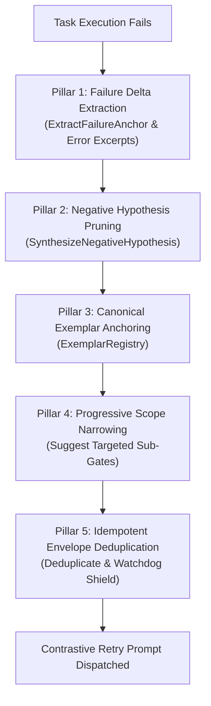

# Adaptive Task Supervision & Failure Delta Illumination Specification

## 1. Executive Summary & Threat Model

### The Cyclical Retry Thrashing Anti-Pattern
When autonomous AI agents or distributed workflow engines encounter task failures (such as compilation errors, unit test assertion failures, or verification gate rejections), naive retry loops repeatedly re-execute the task with identical or uninformative prompts.

In complex software environments, this produces **cyclical retry thrashing**:
1. **Identical Hypothesis Repetition**: The agent generates code attempting the exact same failed syntax or approach across multiple iterations.
2. **Context Dilution**: Error dumps without anchored extraction consume LLM context windows with irrelevant logs.
3. **Runaway Resource Consumption**: Unbounded retries without progressive diagnostic pruning cause CPU exhaustion, API rate limiting, and execution timeouts.
4. **False Idle Watchdog Interruption**: Long-running subtasks are prematurely terminated by upstream orchestrators that mistake deep thinking or test execution for stalled tasks.

---

## 2. 5-Pillar Adaptive Supervision Architecture

To guarantee rapid convergence and deterministic path narrowing, ZQK establishes the **Adaptive Supervision Framework** in `pkg/supervision`:



### Pillar 1: Failure Delta Illumination (`ExtractFailureAnchor`)
- Retries extract structured error anchors (file paths, line numbers, compiler error codes, and panic messages) rather than dumping full process output.
- Non-project-specific heuristics isolate the root fault location, eliminating noise.

### Pillar 2: Negative Hypothesis Pruning (`SynthesizeNegativeHypothesis`)
- Retries explicitly document previously invalidated hypotheses:
  ```json
  {
    "invalidated_approach": "Attempted to use insecure token without validation",
    "failure_reason": "Validator rejected token without cryptographic signature"
  }
  ```
- Contrastive prompts inform the agent: *"Do NOT attempt this invalidated approach again."*

### Pillar 3: Canonical Exemplar Anchoring (`ExemplarRegistry`)
- Resolves idiomatic implementation patterns based on task categorization (e.g. CLI builders, storage engines, HTTP middleware).
- Anchors the agent to repository standards rather than hallucinated patterns.

### Pillar 4: Progressive Scope Narrowing
- When full test suites fail, the supervisor dynamically recommends targeted sub-gate execution (e.g., `go test -run TestTarget` instead of whole-package sweeps) to accelerate iteration loops.

### Pillar 5: Idempotent Envelope Deduplication
- Prevents duplicate task minting across retry intervals.
- Shields executing child tasks from false idle watchdog terminations by establishing active heartbeat envelopes.

---

## 3. Verification & Traceability

### Automated Test Coverage
- **Package**: `pkg/supervision`
- **Test Suites**:
  - `TestExtractFailureAnchor`: Verifies regex and AST anchor isolation across Go test failures, compilation errors, and panics.
  - `TestNegativeHypothesisSynthesis`: Verifies automatic invalidation and contrastive constraint formatting.
  - `TestExemplarRegistryResolution`: Verifies pattern matching by task category.
  - `TestFormatContrastiveRetryPrompt`: Verifies prompt assembly with failure deltas.
  - `TestSupervisionTypesAndDefaults`: Verifies schema invariants and default configurations.
