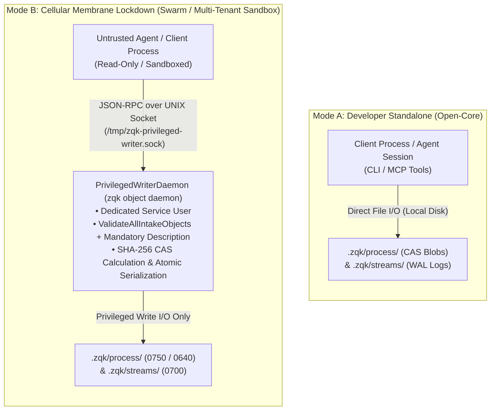
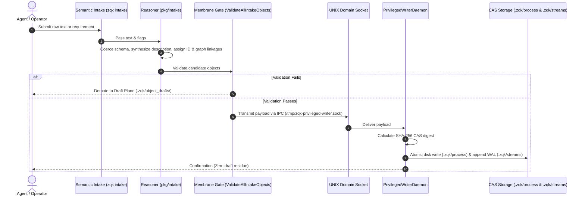

# Cellular Membrane Lockdown & Privileged Writer Mode B Configuration Runbook

> **Specification Reference:** `TSP-CELLULAR-MEMBRANE-MODE-B-001`  
> **Status:** Active / Out-of-the-Box Core  
> **Target Audience:** DevOps, Security Engineers, Platform Operators, Autonomous Agents

---

## 1. Architectural Overview & Dual Modality

The ZQK Knowledge Kernel implements a cellular membrane pattern to enforce strict data-plane integrity, prevent untrusted agent tampering, and maintain immutable Content-Addressable Storage (CAS) and append-only streaming WALs.

The system operates in one of two distinct modes:



### Modality Comparison

| Dimension | Mode A (Developer Standalone) | Mode B (Cellular Membrane Lockdown) |
| :--- | :--- | :--- |
| **Daemon Requirement** | None (Zero background daemons) | Mandatory (`zqk object daemon`) |
| **Socket Rendezvous** | Absent (`/tmp/zqk-privileged-writer.sock` missing) | Active (`0600` socket owned by service user) |
| **Filesystem Access** | Direct client write to `.zqk/process/` and `.zqk/streams/` | Read-only client access; direct writes fail-closed |
| **Integrity Enforcement** | In-process client checks | Isolated out-of-process daemon verification |
| **Recommended Scope** | Local developer workstation, single-seat debugging | Autonomous agent swarms, CI/CD runners, production hosting |

---

## 2. Threat Model & Invariants

Mode B mitigates the following critical attack vectors:

1. **Arbitrary File Traversal / Injection:**
   Even if an agent escapes its workspace boundary or suffers prompt injection, it cannot mutate the kernel graph because `.zqk/process/` is owned by an isolated system user (`zqk-service`) with non-writeable POSIX permissions.
2. **Schema & Description Bypass:**
   Direct YAML tampering is impossible. All writes pass through `ValidateAllIntakeObjects`. Any object lacking a required `description` (POL-DOC-001) is rejected or demoted to the Draft Plane (`.zqk/object_drafts/`).
3. **Audit Trail Tampering:**
   The lifecycle mutation stream (`.zqk/streams/`) is append-only and writable exclusively by the daemon process ID.
4. **CAS Ghost Refs:**
   The daemon computes the canonical SHA-256 hash and updates `.zqk/process/<kind>/.<kind>.index` in an atomic step, eliminating partial writes and orphan hash files.

---

## 3. Out-of-the-Box Configuration

### 3.1 Dedicated Service Identity & POSIX Permissions

To establish the cellular membrane boundary, configure the filesystem permissions so that only the service user has write privileges:

```bash
# 1. Create the dedicated service group and user (Linux example)
sudo groupadd -r zqk-service
sudo useradd -r -g zqk-service -d /var/empty -s /sbin/nologin zqk-service

# 2. Assign ownership of the process and stream directories to zqk-service
sudo chown -R zqk-service:zqk-service .zqk/process/ .zqk/streams/

# 3. Restrict permissions: Owner RWX, Group/Others Read-Only
sudo chmod -R 750 .zqk/process/
sudo chmod -R 700 .zqk/streams/
find .zqk/process/ -type f -exec sudo chmod 640 {} +
find .zqk/streams/ -type f -exec sudo chmod 600 {} +

# 4. Add untrusted agents/developers to the zqk-service group for read access
sudo usermod -aG zqk-service agent-runner
```

*(Note: On single-user development machines testing Mode B, you can run the daemon under your own user account; the socket existence alone activates the Mode B software barrier across all client commands).*

---

## 3.2 Service Deployment Configurations

#### A. macOS LaunchAgent (`com.zqk.privileged-writer.plist`)

Install to `~/Library/LaunchAgents/com.zqk.privileged-writer.plist`:

```xml
<?xml version="1.0" encoding="UTF-8"?>
<!DOCTYPE plist PUBLIC "-//Apple//DTD PLIST 1.0//EN" "http://www.apple.com/DTDs/PropertyList-1.0.dtd">
<plist version="1.0">
<dict>
    <key>Label</key>
    <string>com.zqk.privileged-writer</string>
    <key>ProgramArguments</key>
    <array>
        <string>/usr/local/bin/zqk</string>
        <string>object</string>
        <string>daemon</string>
        <string>--socket</string>
        <string>/tmp/zqk-privileged-writer.sock</string>
    </array>
    <key>RunAtLoad</key>
    <true/>
    <key>KeepAlive</key>
    <true/>
    <key>StandardOutPath</key>
    <string>/tmp/zqk-privileged-writer.log</string>
    <key>StandardErrorPath</key>
    <string>/tmp/zqk-privileged-writer.err</string>
    <key>WorkingDirectory</key>
    <string>/Users/shared/zqk-workspace</string>
</dict>
</plist>
```

Activate the LaunchAgent:
```bash
launchctl load ~/Library/LaunchAgents/com.zqk.privileged-writer.plist
```

#### B. Linux systemd Service (`zqk-privileged-writer.service`)

Install to `/etc/systemd/system/zqk-privileged-writer.service`:

```ini
[Unit]
Description=ZQK Knowledge Kernel Privileged Writer Daemon (Mode B)
After=network.target

[Service]
Type=simple
User=zqk-service
Group=zqk-service
WorkingDirectory=/opt/zqk-workspace
ExecStart=/usr/local/bin/zqk object daemon --socket /tmp/zqk-privileged-writer.sock
Restart=always
RestartSec=3
StandardOutput=journal
StandardError=journal
UMask=0027

[Install]
WantedBy=multi-user.target
```

Enable and start the service:
```bash
sudo systemctl daemon-reload
sudo systemctl enable --now zqk-privileged-writer
```

---

## 3.3 Manual / CLI Foreground Startup

For interactive testing or development sandboxes:

```bash
# Start the privileged writer daemon in foreground mode
./bin/zqk object daemon --socket /tmp/zqk-privileged-writer.sock

# Or start in background
nohup ./bin/zqk object daemon --socket /tmp/zqk-privileged-writer.sock > /tmp/zqk-writer.log 2>&1 &
```

Verify socket presence and permissions:
```bash
ls -la /tmp/zqk-privileged-writer.sock
# Expected output:
# srw------- 1 <user> <group> 0 Sep 19 02:40 /tmp/zqk-privileged-writer.sock
```

---

## 4. Semantic Intake Receptor Integration

In Mode B, agents do not construct CAS files directly on disk. Instead, agents submit mutations through the **Semantic Intake Receptor** (`zqk intake` or `zqk tray run intake`):

```bash
# Agent or operator submits free-form requirement or intent
./bin/zqk intake "Implement rate limiting middleware for HTTP proxy endpoints" \
    --kind requirement \
    --priority p1 \
    --format json
```

### The Direct-to-CAS Lifecycle Pipeline



1. **Input Reception:** `zqk intake "..."` receives raw text and optional flags.
2. **Semantic Reasoning (`pkg/intake/reasoner.go`):** Coerces text into valid schema attributes, synthesizes mandatory description (POL-DOC-001), generates deterministic entity IDs (`REQ-*`, `BLI-*`, etc.), and establishes graph linkages.
3. **Pre-Flight Membrane Verification:** Calls `ValidateAllIntakeObjects()`. If invalid, demoted to Draft Plane (`.zqk/object_drafts/`) for human review; if valid, routed to `IPCWriter`.
4. **IPC Socket Transmission:** Transmits payload over `/tmp/zqk-privileged-writer.sock` to daemon.
5. **Privileged Materialization:** `PrivilegedWriterDaemon` hashes payload via SHA-256, writes directly to `.zqk/process/<kind>/<hash>.yaml`, updates CAS index, and records mutation in `.zqk/streams/` (zero draft plane residue, zero manual promotion steps required).

---

## 5. Verification & Testing Runbook

### Test 1: Direct Write Prohibited in Mode B
When the daemon is running, direct client filesystem writes are rejected fail-closed:

```bash
# Verify socket exists
test -S /tmp/zqk-privileged-writer.sock && echo "Socket active"

# Attempt a direct object update or creation without IPC
# The membrane router will detect the active socket and route through IPCWriter.
# If an unauthorized direct file write is attempted on locked permissions:
touch .zqk/process/requirements/test.yaml
# Expected output:
# touch: .zqk/process/requirements/test.yaml: Permission denied
```

### Test 2: Ingest Object via Semantic Receptor
Verify that the intake pipeline routes through the privileged daemon into CAS:

```bash
./bin/zqk intake "Harden privileged writer socket authentication against impersonation" \
    --kind requirement \
    --priority p1

# Verify the object materialized into the CAS index
./bin/zqk object list requirement --limit 1
```

### Test 3: System Check Telemetry
Run `zqk system check` to verify kernel health:

```bash
./bin/zqk system check
```

Under **Layer 4: I/O Resource Hygiene & Storage Telemetry**, observe:
- `Open File Descriptors`: within healthy limits (e.g. `10 / 245760`).
- `Stale Lock Files`: 0 or monitored.
- `Orphaned Temp Files`: 0 clean.
- Membrane integrity: `✓ System check passed. No violations found.`

---

## 6. Host Service Wrangler Integration

ZQK provides a unified service manager for all daemon processes:

```bash
# Check service status
./bin/zqk scheduler service status com.zqk.privileged-writer

# Restart service
./bin/zqk scheduler service restart com.zqk.privileged-writer

# Stop service (reverts system back to Mode A)
./bin/zqk scheduler service stop com.zqk.privileged-writer
```

When stopped, the socket `/tmp/zqk-privileged-writer.sock` is automatically unlinked, cleanly transitioning the environment back to Mode A.
