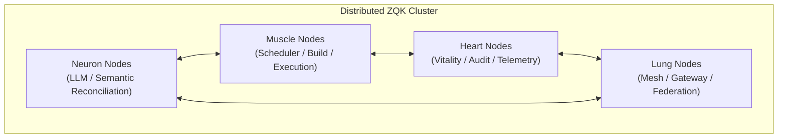
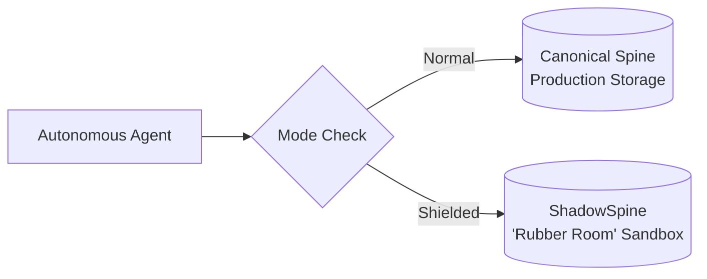

# Cellular Specialization Tiers & The Rubber Room Architecture

This document establishes the architecture of ZQK's cellular specialization model (`pkg/specialization`), explaining how node roles are segmented in distributed clusters and how side-effect sandboxing is enforced.

---

## 1. Motivation: Beyond Monolithic Swarms

In small repositories and single-workstation local development, running all ZQK services (scheduler, inference workers, mesh peering, telemetry collectors, and reconcilers) inside a single process is simple and ergonomic.

However, in production swarms, heterogeneous hardware demands workload separation:
- Inference nodes require high-throughput GPU access and large model contexts.
- Execution nodes require isolated filesystem access, compilers, and Docker engines.
- Telemetry nodes require high I/O throughput to ingest continuous change journals and trace buffers.

ZQK achieves this through **Cellular Specialization**, mapping nodes to distinct biological organ tiers.

---

## 2. Specialization Matrix



### Tier Definitions

1. **`TierAll` (`"all"`)**:
   - Monolithic posture. Runs every handler and subsystem.
   - Default setting for community and single-machine developers.
2. **`TierNeuron` (`"neuron"`)**:
   - Dedicated to sensing, inference, semantic validation, and state reconciliation.
   - Activates `NeuronHandler`. Skips local task execution and build daemons.
3. **`TierMuscle` (`"muscle"`)**:
   - The heavy lifter: orchestrates task queue processing, scheduled jobs, document indexing, and code builds.
   - Activates `MuscleHandler`.
4. **`TierHeart` (`"heart"`)**:
   - The vitality monitor: tracks node health, heartbeat pings, CAS hash drift, and metrics aggregation.
   - Activates `HeartHandler`.
5. **`TierLung` (`"lung"`)**:
   - The respiratory system: manages cross-datacenter transport, peering handshakes, and event mesh fan-out.

---

## 3. Side-Effect Sandboxing: Mode Shielded & The Rubber Room

When evaluating autonomous agent output or executing unverified scripts, mutations cannot be allowed to pollute the canonical knowledge graph.

ZQK defines two operational modes:
- **`ModeNormal`**: Commits directly to canonical storage (`.zqk/objects/`, CAS tree).
- **`ModeShielded`**: Redirects all object storage and filesystem writes to an in-memory or ephemeral copy-on-write layer known as the **ShadowSpine ("Rubber Room")**.



In `ModeShielded`:
1. Reads seamlessly cascade: if an object exists in the Rubber Room, it is returned; otherwise, it falls back to reading the canonical spine.
2. Writes are isolated: all creates, updates, and deletes are captured strictly in the ShadowSpine.
3. On completion of the evaluation, the entire Rubber Room can be committed as an atomic promotion or discarded cleanly without leaving residual debris.

---

## 4. Operational Runbook

### Setting Node Specialization
```bash
# Export the tier before launching daemon
export ZQK_SPECIALIZATION_TIER=neuron
zqk scheduler daemon
```

### Checking Active Node Tier
```bash
zqk system status --specialization
```
