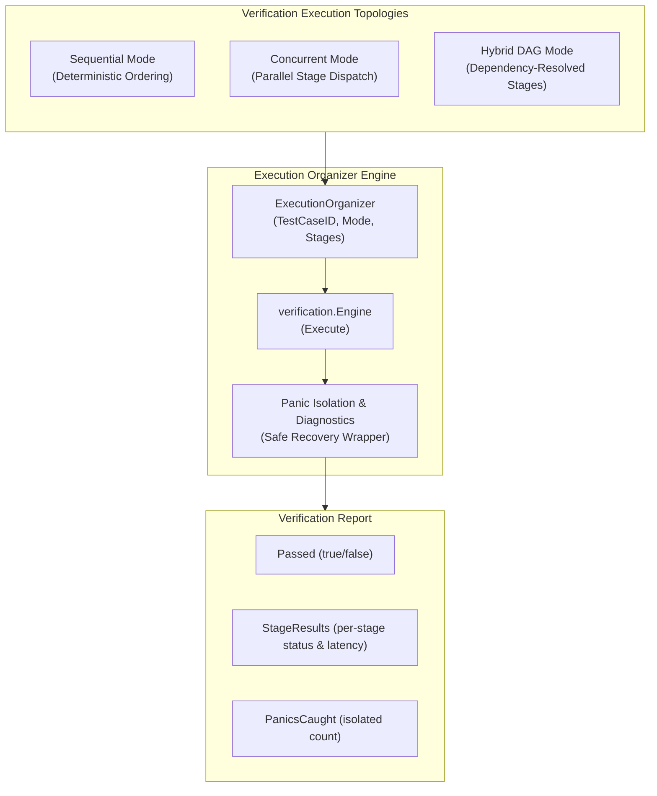

# Composite Execution Organizer Verification Topologies

## Overview
The Verification Engine (`pkg/kernel/verification`) and CLI verification integration (`zqk system verify-completion`) provide rigorous, cryptographically verifiable multi-criteria verification topologies across sequential, concurrent, and hybrid DAG dispatch modes with complete panic isolation.

## Architecture



## Execution Modes

1. **Sequential Mode (`sequential`)**:
   - Stages execute sequentially in defined slice order.
   - Ideal for linear acceptance verification where downstream criteria require upstream state.

2. **Concurrent Mode (`concurrent`)**:
   - Independent verification stages execute concurrently across worker goroutines.
   - Minimizes wall-clock latency for isolated static floor assertions and external probes.

3. **Hybrid DAG Mode (`hybrid_dag`)**:
   - Stages declare explicit dependencies via `DependsOn: []string`.
   - Kahn's topological sort determines execution tiers; independent stages in each tier execute concurrently while dependent stages wait for root completion.

4. **Panic Isolation**:
   - Any stage panic (simulated or runtime) is caught via deferred recovery.
   - The engine isolates the stage failure, records complete stack diagnostics on the stage result, increments `PanicsCaught`, and fails the stage gracefully without aborting the parent process.

## CLI Usage

```bash
# Standard cryptographic hash verification
zqk system verify-completion TST-001

# Multi-criteria composite execution organizer (sequential)
zqk system verify-completion TST-001 --organizer

# Multi-criteria composite execution organizer (concurrent)
zqk system verify-completion TST-001 --organizer --topology concurrent

# Multi-criteria composite execution organizer (hybrid DAG)
zqk system verify-completion TST-001 --organizer --topology hybrid_dag
```
