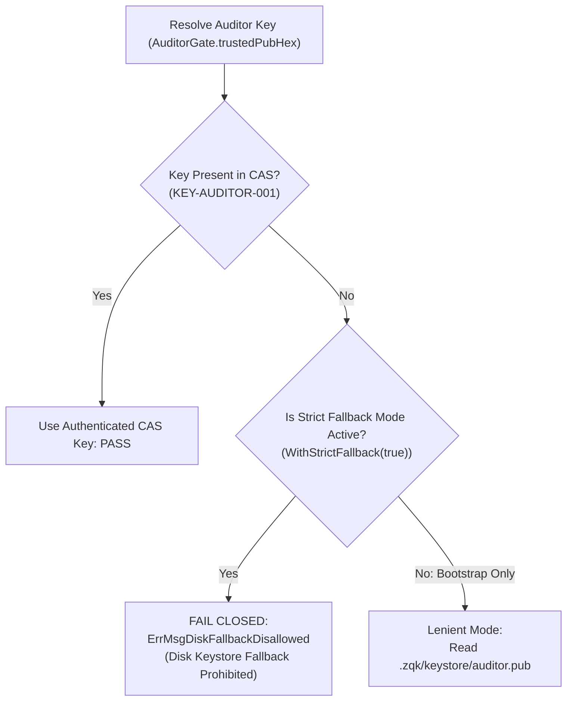

# Cryptographic Keystore Security & Fallback Guard Specification

## 1. Executive Summary & Threat Model

### The Keystore Fallback Vulnerability
In decentralized, content-addressed knowledge systems, cryptographic signing and verification (such as `QASuccess` token minting and validation in `AuditorGate`) establish the immutable proof of software quality and policy compliance.

When the signing key (`KEY-AUDITOR-001`) is referenced during verification, the key material must be loaded from an authenticated, content-addressed storage (CAS) object. If the key object is missing from CAS, naive fallback implementations could attempt to read an unencrypted private or public key directly from the local workspace filesystem (`.zqk/keystore/auditor.priv` or `auditor.pub`).

In multi-tenant or untrusted execution environments (e.g. CI runners, public sandboxes, or containerized agents), unauthenticated disk fallback introduces severe security risks:
1. **Key Tampering**: An unprivileged process could overwrite local disk keystore files to forge validation attestations.
2. **Attestation Spoofing**: Erroneous or simulated verification tokens could bypass strict supply-chain policy checks.
3. **Loss of Non-Repudiation**: Without CAS object hashing and cryptographic lineage, auditor identity cannot be mathematically proven.

---

## 2. Security Architecture & Invariants

To eliminate keystore fallback vulnerabilities while accommodating Day-0 bootstrap initialization, ZQK establishes a strict boundary model:



### Invariant 1: Fail-Closed Strict Verification Mode
In all production, release-candidate, and CI verification workflows, `AuditorGate` operates with strict fallback enforcement:
```go
gate := NewAuditorGateForProject(store, projectRoot).WithStrictFallback(true)
```
When `KEY-AUDITOR-001` is absent from CAS, the gate strictly refuses to read the local disk fallback, returning:
```
ErrMsgDiskFallbackDisallowed: AuditorGate: disk keystore fallback disallowed in strict mode
```

### Invariant 2: CAS Key Object Provenance
Auditor keys registered in CAS must conform to the kernel's cryptographic schema:
- Object kind: `key` or `account`
- Identifier: `KEY-AUDITOR-001`
- Description/Payload: Contains the canonical hexadecimal-encoded Ed25519 public key.
- Provenance: Validated against system provenance and non-repudiation invariants.

### Invariant 3: Controlled Bootstrap Transition
Lenient fallback is restricted solely to Day-0 workspace initialization before the kernel CAS store has materialized the root cryptographic authority. Once the kernel reaches `originated` or `active` operational states, strict fallback mode is universally enforced.

---

## 3. Verification & Traceability

### Automated Test Coverage
The strict fallback guard is verified by comprehensive unit and integration tests:
- **Test Suite**: `pkg/validation/qa/extra_coverage_test.go:TestAuditorGate_StrictFallbackDisallowed`
- **Assertions**:
  1. Rejection of disk fallback when `KEY-AUDITOR-001` is missing from CAS in strict mode.
  2. Successful resolution when `KEY-AUDITOR-001` is present in CAS.
  3. Controlled fallback only when lenient mode is explicitly enabled (`WithStrictFallback(false)`).
