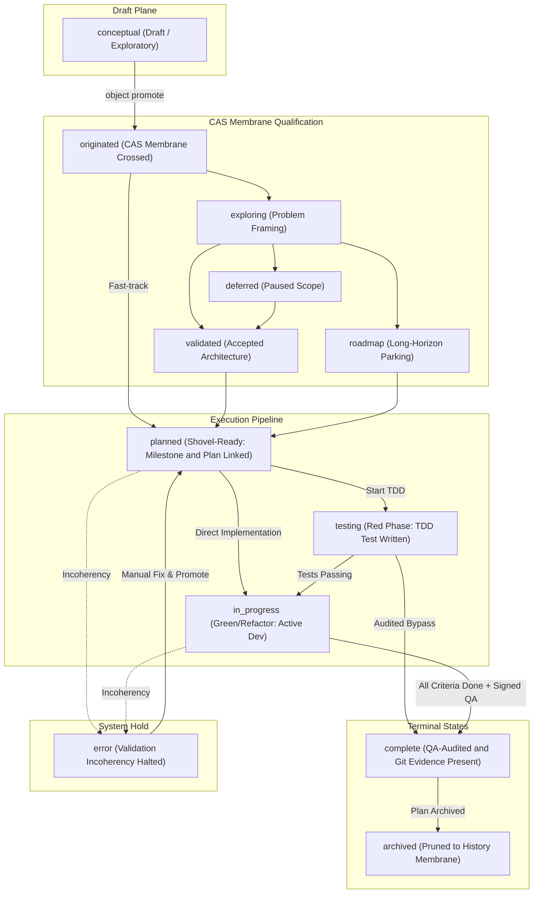
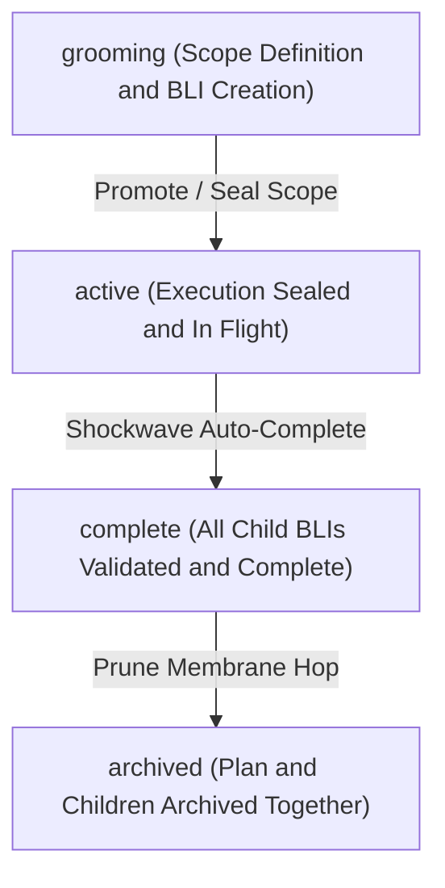

# Visual Lifecycle State Machines and Transition Check-Valves Guide

## Overview

In the ZQK Knowledge Kernel, objects do not experience arbitrary, ad-hoc status updates. Every object kind is governed by an explicit **Lifecycle State Machine** declared in `.zqk/specs/lifecycles/` (or pack lifecycle specs).

State transitions are protected by unidirectional **check-valves** (preconditions, postconditions, and cryptographic quality gates) that enforce rigor across autonomous loops and prevent regression.

---

## 1. Backlog Item Lifecycle State Machine

A `backlog_item` represents a concrete execution work unit. It flows through five distinct operational phases:

---

## 2. Transition Roles & Operational Semantics

Each status in the lifecycle maps to a specialized **Role** that dictates scheduler priority and agent permissions:

| Role | Semantic Meaning | Example Statuses | Behaviors & Constraints |
| :--- | :--- | :--- | :--- |
| `realign` | Formulation & Refinement | `conceptual`, `originated`, `exploring`, `validated` | Objects can be freely edited, re-scoped, or parked without breaking active execution pipelines. |
| `shovel_ready` | Actionable Work | `planned` | Requires linked priority plan and at least one milestone. Guaranteed ready for immediate assignment. |
| `execution_locked` | Work In Flight | `testing`, `in_progress` | Lock is held by an agent or developer. Preconditions prevent simultaneous competing mutations. |
| `terminal` | Work Finished | `complete`, `archived` | Complete requires verified tests, git mutation evidence, and signed QA tokens. Archival is hierarchical. |
| `halted` | System Exception | `error` | Read-only containment until validation repair recipe is executed. |

---

## 3. Transition Check-Valves (Preconditions & Pre-Requisites)

Transitions are evaluated by the Kernel Lifecycle Validator prior to state mutation. Key check-valves include:

1. **Membrane Crossing (`conceptual` → `originated`)**:
   - Strips ephemeral draft metadata.
   - Enforces unique object ID generation and valid schema typing.
   - Writes immutable CAS blob.
2. **Shovel-Ready Gate (`validated` → `planned`)**:
   - Asserts `priority_plan_ref` is populated.
   - Asserts at least one valid `milestone_refs` exists in the graph.
3. **Execution Lock Gate (`planned` → `in_progress` / `testing`)**:
   - Validates that all linked criteria (`criteria_refs`) have matching test cases.
   - Verifies agent capacity or claims seat locks.
4. **Completion Check-Valve (`in_progress` → `complete`)**:
   - **Latch 1 (Data Existence)**: Deliverable artifacts must exist on disk and be readable.
   - **Latch 2 (AST & Invariants)**: All declared `.go` artifacts must pass AST hygiene (zero magic literals, no swallowed errors).
   - **Latch 3 (Cryptographic Signature)**: A verified `qa_success` object signed by the Auditor private key must exist in CAS.
   - **Latch 4 (Git Evidence)**: Commit hashes must be present in the repository history referencing the BLI ID.

---

## 4. Priority Plan Lifecycle State Machine

Priority plans aggregate backlog items into strategic delivery blocks:

- **Scope Sealing**: When a priority plan transitions from `grooming` to `active`, the plan is sealed. No new backlog items may be arbitrarily appended without unsealing.
- **Shockwave Completion**: As the final child backlog item reaches `complete`, the kernel emits a status shockwave that automatically checks plan completion and advances the plan.
- **Stage Membrane Hop (Archive Burrito)**: Archiving a plan automatically bundles all child objects into the archive membrane, ensuring no orphaned backlog items remain in the active query stream.

---

## Canonical References
- [Modular Pack Composition Architecture](PACK_COMPOSITION_AND_EXTENSIBILITY.md)
- [Ambient Signal Interpretation & Action Rubric](AMBIENT_SIGNAL_ACTION_RUBRIC.md)
- [Architecture Index](../INDEX.md)
