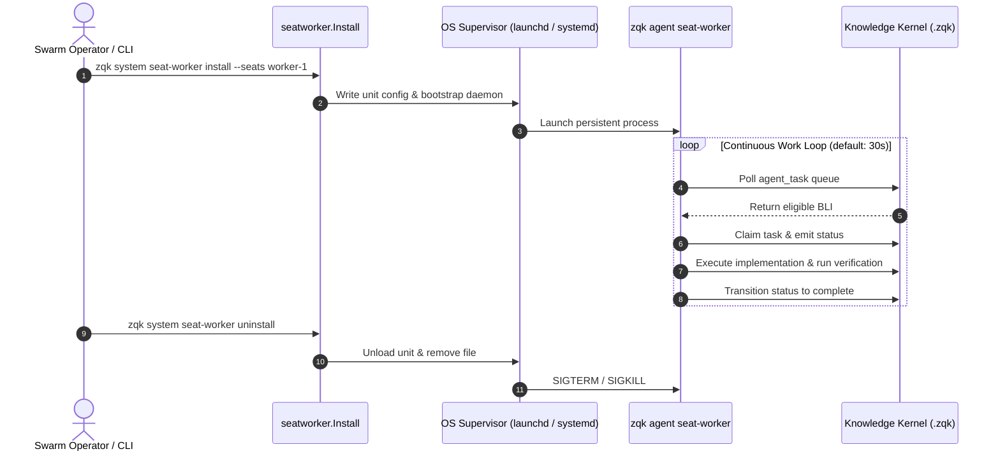

# Seat Worker Supervisor Architecture

This document specifies the operational design, security model, and lifecycle management for persistent ZQK agent seat workers (`pkg/seatworker`).

---

## 1. Overview

In multi-agent collaborative engineering, agents require defined operating seats with distinct responsibilities and communication handles. While foreground interactive sessions are suitable for targeted developer tasks, distributed swarm orchestration requires non-interactive background agents that persist across workstation lifecycles.

Rather than relying on brittle shell backgrounding (`nohup`, `screen`, `tmux`) or non-standard process loops, ZQK delegates process supervision directly to the operating system's native init framework:
- **macOS**: `launchd` via user-level launch agents.
- **Linux**: `systemd` via user units (`systemd --user`).

---

## 2. Supervisor Lifecycle Diagram



---

## 3. Configuration & CLI Invocations

### Installing a Seat Worker
```bash
# Install supervisor daemon for seat-1 and seat-2
zqk system seat-worker install --seats seat-1,seat-2 --poll-seconds 30

# Install with explicit persona override
zqk system seat-worker install --seats tpm-seat --persona-ref "persona:tpm"
```

### Inspecting Status
```bash
# macOS
launchctl list | grep zqk

# Linux
systemctl --user status "zqk-mesh-seat-worker@*"
```

### Uninstalling
```bash
zqk system seat-worker uninstall --seats seat-1,seat-2
```

---

## 4. Failure Recovery & Health Probes

1. **Automatic Restart on Crash**: Units configure `KeepAlive` (`launchd`) and `Restart=on-failure` (`systemd`), ensuring crash loops trigger exponential restart throttling.
2. **Heartbeat Liveness**: Seat workers continuously emit heartbeat timestamps to `.zqk/metrics/seats/<seat>.json`. If a worker process hangs or stalls on an external deadlock, the scheduler's `Hourglass` monitor marks the seat orphaned and reassigns in-flight tasks.
