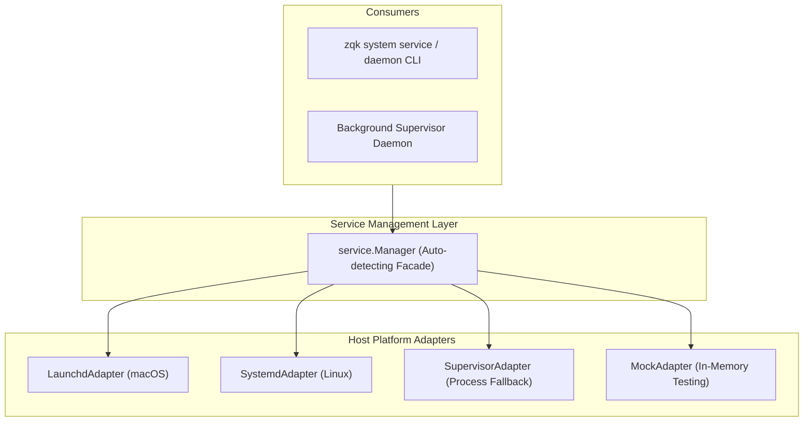

# Zero-Coupling ServiceAdapter Specification & Architecture

## Overview
The `pkg/service` package defines a pure, zero-coupling contract for managing OS-level service daemons (such as launchd, systemd, and local process supervisors) with zero internal dependencies on `pkg/kernel` or internal ZQK runtime facilities.

## Architecture

## Core Contracts & Invariants

1. **Zero Internal Coupling**:
   - `pkg/service` imports only standard library packages and path utilities.
   - It contains zero imports of `pkg/kernel`, `pkg/storage`, or internal runtime layers, enabling standalone library extraction.

2. **Pluggable Host Adapters**:
   - `LaunchdAdapter`: Generates valid XML plists and manages launchctl services on Darwin.
   - `SystemdAdapter`: Generates compliant systemd unit files on Linux.
   - `SupervisorAdapter`: Provides portable cross-platform process management when host supervisors are unavailable.
   - `MockAdapter`: In-memory test double supporting full lifecycle simulation and legacy cleanup.

3. **Autonomous Host Detection**:
   - `service.NewManager(nil)` detects the host operating system (`runtime.GOOS`) and instantiates the appropriate adapter automatically.

## Host Platform Adapter Implementation Details

### 1. macOS Launchd Adapter
- Encapsulates `.plist` generation under `~/Library/LaunchAgents` or `/Library/LaunchDaemons`.
- Configures key attributes: `Label`, `ProgramArguments`, `RunAtLoad`, and `KeepAlive`.
- Interacts with `launchctl` using deterministic process management.

### 2. Linux Systemd Adapter
- Generates systemd unit files under `~/.config/systemd/user/` or `/etc/systemd/system/`.
- Configures `[Unit]`, `[Service]`, and `[Install]` sections with `Restart=always|on-failure|no`.
- Interacts with `systemctl` for daemon-reload and unit lifecycle commands.

### 3. Local Process Supervisor Fallback
- Operates when native system init is unavailable or in containerized sandboxes.
- Tracks process states (running, stopped, failed) with PID files and signal handling.

## ServiceManager Facade API

The `service.Manager` struct provides high-level unified lifecycle orchestration:
- `Install(ctx, spec)`: Validates spec invariants and delegates to the active platform adapter.
- `Uninstall(ctx, id)`: Unregisters and removes service descriptor files.
- `Start(ctx, id)` / `Stop(ctx, id)` / `Restart(ctx, id)`: Controls process lifecycle states.
- `Status(ctx, id)`: Returns normalized `ServiceStatus` (PID, State, Uptime).
- `CleanupLegacy(ctx, legacyIDs)`: Bulk sweeps orphaned and superseded service identifiers.

