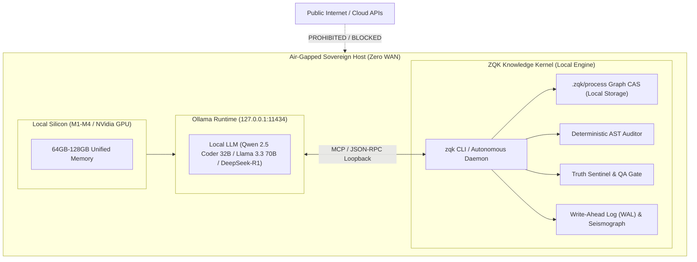

# Sovereign Air-Gapped AI Engineering Specification

## Executive Summary & Strategic Rationale

As AI coding assistants proliferate, enterprise adoption in high-security, defense, intelligence, healthcare, and aerospace sectors faces a fatal barrier: **data exfiltration and reliance on external cloud inference APIs**. Cloud-hosted foundation models (Claude Code, Cursor, Gemini, Copilot) require constant outbound WAN connectivity, streaming proprietary intellectual property, cryptographic keys, and system architecture across public internet networks.

ZQK provides **Sovereign Air-Gapped AI Engineering**: the capability to run an autonomous multi-agent engineering swarm entirely on local hardware (such as an Apple Silicon MacBook Pro M1–M4 Ultra/Max with 64GB–128GB unified memory or an offline Linux workstation) with **zero internet connectivity**, utilizing **Ollama** as the primary agent host and LLM runtime.

Because ZQK anchors agent execution to an immutable, local-first Knowledge Kernel graph rather than LLM conversational memory, local quantized models operate with zero drift, verified criteria done-gates, and mathematical reproducibility.

---

## Architecture: Zero-Exfiltration Knowledge Kernel



### Core Invariants

1. **Zero Outbound Telemetry**: In air-gapped mode, ZQK performs zero external network calls. All process data, AST scanning, cryptographic signing, and graph mutations execute locally within `.zqk/process/`.
2. **Loopback-Only RPC**: Ollama communicates strictly via loopback (`127.0.0.1:11434` or local Unix domain sockets).
3. **Fail-Closed Verification**: Smaller local models have higher variance than 2-trillion parameter cloud models. ZQK mitigates this through deterministic ontological constraints: an agent cannot mark work complete simply by claiming it is done; the cryptographic **Truth Sentinel** and **AST Auditor** enforce criteria compliance and test proof before any milestone can advance.

---

## Ollama First-Class Host Detection & Seating

ZQK automatically identifies an air-gapped Ollama environment through filesystem markers and loopback probing:

### Detection Vectors
- **Filesystem Markers**: `.ollama/`, `OLLAMA.md`, `Modelfile` in project root or parent hierarchies.
- **Loopback Probe**: Direct HTTP GET on `http://127.0.0.1:11434/api/tags` (guarded to avoid hanging in offline unit-test suites).

### Onboarding Command
```bash
# Detect local host, generate vendor directives, and seat default personas:
zqk system agent-onboard
```

Upon detection of `VendorOllama`:
1. `AGENTS.md` is primed with offline execution directives tailored for local quantized context limits (4k–32k windowing).
2. Persona seating binds `PER-COMMUNITY-SOFTWARE-ENGINEER` and `PER-COMMUNITY-TPM` to the local execution runtime.
3. The orchestration layer directs tool dispatch and subagent invocations through local MCP endpoints without attempting external API handshakes.

---

## Hardware Sizing & Recommended Local Models

| Hardware Tier | Memory | Recommended Ollama Model | Quantization | Context Window | Use Case |
| :--- | :--- | :--- | :--- | :--- | :--- |
| **Ultra High** | 64GB – 128GB Unified RAM (M1/M2/M3/M4 Max/Ultra) | `qwen2.5-coder:32b` or `llama3.3:70b-instruct-q4_K_M` | Q4_K_M / Q8_0 | 32,768 tokens | Full autonomous engineering director, multi-agent swarm orchestration. |
| **High** | 32GB – 48GB Unified RAM (M-series Pro / 24GB VRAM GPU) | `qwen2.5-coder:14b` or `deepseek-r1:14b` | Q8_0 / Q4_K_M | 16,384 tokens | Core implementation, refactoring, test case authoring. |
| **Standard** | 16GB – 24GB Unified RAM (Base M-series / 12GB VRAM GPU) | `qwen2.5-coder:7b` | Q8_0 | 8,192 tokens | Targeted BLI execution, bug fixes, single-package drying. |

---

## Offline Zero-Internet Workflow

### 1. Preparation (Base Machine Setup while Online)
Pre-pull the desired models onto your workstation prior to disconnecting from the external network:
```bash
ollama pull qwen2.5-coder:32b
ollama pull deepseek-r1:14b
```

### 2. Physical Disconnect (Air-Gap)
Disconnect Wi-Fi / Ethernet. Ensure all network interfaces are isolated or bound strictly to `lo0` (`127.0.0.1`).

### 3. Repository Initialization
```bash
# Initialize project with knowledge graph and onboarding roadmap
zqk system init --with-onboarding-roadmap

# Discover and prime the local Ollama environment
zqk system agent-onboard

# Verify system integrity and kernel graph
zqk system check
```

### 4. Autonomous Execution Cycle
```bash
# Inspect the shovel-ready plan and backlog items
zqk workflow whats-next

# Autonomous execution: claim, execute, and verify against AST gates
zqk do

# View real-time visual Mission Control & DAG locally
zqk ui -w
```

---

## How ZQK Overcomes Local LLM Limitations

Local LLMs (e.g. 14B–32B parameters) traditionally struggle with large software architectures due to context drift, hallucinated dependencies, and premature declarations of task completion. ZQK's architecture is uniquely engineered to eliminate these failure modes:

1. **Context-Bound Slicing (`zqk agent prepare-context`)**:
   Instead of dumping the entire repository into context, ZQK feeds the local LLM only the active Backlog Item, its strict parent Requirement, associated Criteria, and targeted source files.
2. **Deterministic AST Auditing**:
   The local model's output is audited by Go's native compiler AST before acceptance:
   - Functions exceeding 100 lines are flagged.
   - Swallowed errors (`_ = ...`) are rejected.
   - Structural code duplication across functions is detected and failed closed.
3. **Cryptographic Proof-of-Done (`QASuccess`)**:
   An agent running on Ollama cannot transition a task to `complete` through text alone. The Knowledge Kernel requires automated tests to execute, criteria verification to pass, and a cryptographically signed QA token to be minted.
4. **Resilient Local RPC Mesh**:
   RPC connection pools in `pkg/graph/rpcpool` maintain thread-safe, multiplexed communication between the autonomous agent loop and the Knowledge Kernel without deadlocks or thread exhaustion.

---

## Conclusion

With ZQK and Ollama, sovereign organizations achieve full autonomous engineering capability without compromising network boundaries, security policies, or intellectual property. The developer's workstation becomes a self-contained, air-gapped software factory.
