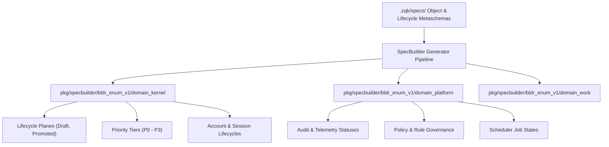

<!-- tags: codegen, specbuilder, ast, enums, architecture, compilation -->

# SpecBuilder Code Generation & AST Optimization Architecture

## 1. Executive Summary & Design Rationale

The ZQK SpecBuilder pipeline compiles declarative schema specifications (`.zqk/specs/`) into high-performance, strongly-typed Go builders, validators, and domain enumerations. 

Early code generation architectures generated discrete micro-packages for every schema entity and status type (e.g. `bldr_enum_v1/shared_agent_instructions`, `bldr_enum_v1/policies`, `bldr_enum_v1/roles`). While conceptually decoupled, this granular strategy introduced severe compiler and runtime overhead:
1. **Compiler Symbol Table Inflation**: Hundreds of micro-packages saturated the Go compiler's package graph, resulting in excessive AST allocations, slow type-checking passes, and lengthened CI compilation times.
2. **Epistemic Divergence**: Having separate micro-packages for every status created dual sources of truth against canonical strings declared in `pkg/objects`.
3. **Namespace Duplication**: Divergent singular and plural packages emerged without clean boundary definitions.

To solve this, ZQK adopts a **Consolidated Domain Architecture** for generated enums, builders, and AST pruning, maintaining zero runtime overhead while enforcing strict compile-time type safety.

---

## 2. Domain Partitioning Architecture

Rather than generating an isolated package for every entity or schema kind, code generation groups enums into cohesive, domain-scoped packages under `pkg/specbuilder/bldr_enum_v1/`:



### Core Domain Groupings:
- **`domain_kernel`**:
  Houses core kernel lifecycle, state, priority, and session enums:
  - `PlaneDraft`, `PlanePromoted`
  - `PriorityTierP0` through `PriorityTierP3`
  - `AccountStatusActive`, `AccountStatusSuspended`
  - `SessionStatusActive`, `SessionStatusArchived`, `SessionStatusCompleted`
- **`domain_platform`**:
  Houses platform operational, governance, and audit enums:
  - `AuditStatusActive`, `AuditStatusArchived`
  - `PolicyStatusActive`, `PolicyStatusInactive`
  - `RuleStatusImplemented`, `RuleStatusDraft`
  - `SchedulerJobStatusActive`, `SchedulerJobStatusPending`

Each domain package exports strongly-typed enums backed by primitive Go types (`string`), annotated with serialization helpers and validated against canonical definitions in `pkg/objects`.

---

## 3. AST Pruning & Architectural Guardrails

To prevent package bloat from recurring, automated verification in `pkg/testkit/enum_consolidation_test.go` enforces structural ceilings on generated packages:

```go
// Enforces a strict ceiling on bldr_enum_v1 directory count.
func TestEnumConsolidation_DirectoryCount_StaticFloor(t *testing.T) {
    ...
    assert.LessOrEqual(t, dirCount, 140, "bldr_enum_v1 package count must not exceed static ceiling")
}
```

### Fail-Closed Validation Invariant
All domain enums implement fail-closed boundary checking. Any unmapped or unrecognized status string coerced to a domain enum type is rejected by validation assertions, preventing silent data corruption across subsystem boundaries:

```go
func TestEnumConsolidation_InvalidEnumRejection_NegativeBoundary(t *testing.T) {
    ...
    for _, invalid := range invalidStatuses {
        coerced := domain_kernel.ZqkSessionStatus(invalid)
        assert.False(t, validSessionStatuses[coerced], "invalid status %q must be rejected by domain enum validator", invalid)
    }
}
```

---

## 4. Migration & Evolution Principles

1. **Cohesive Domain Boundaries**: New schema enums must be mapped into their existing domain package (`domain_kernel`, `domain_platform`, or domain-specific packs) rather than creating new standalone micro-packages.
2. **Canonical Correspondence**: All enum string literals must correspond 1:1 with lifecycle definitions in `.zqk/specs/lifecycles/` and object metaschemas in `.zqk/specs/objects/`.
3. **Continuous AST Compaction**: Builders and enum sets must be verified against `make lint` and `zqk-vet` to prevent code duplication or unnecessary symbol exports.
