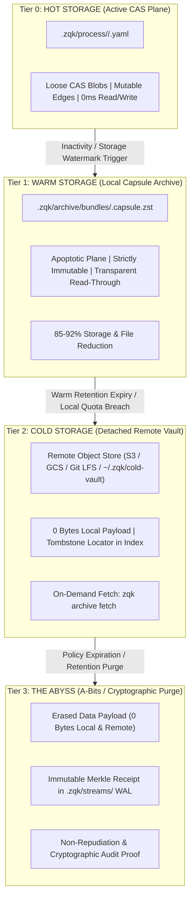

# Tiered Storage, Subtree Flattening, and Archival Lifecycle

> **Technical Specification:** `TSP-TIERED-STORAGE-ARCHIVE-001`  
> **Governing Policy:** `POL-STORAGE-RETENTION-001`  
> **Status:** Approved / Active Architecture  
> **Target Audience:** Core Storage Architects, DevOps, Agent Operators, Platform Engineers

---

## 1. Executive Summary & Scaling Mandate

In high-velocity AI coding environments, autonomous agent swarms produce immense volumes of process entities: goals, milestones, requirements, acceptance criteria, backlog items, tasks, and verification receipts. 

Historically, setting an entity's status to `archived` was purely a metadata label—the underlying YAML blob remained loose on local disk in `.zqk/process/<kind>/<hash>.yaml`. As the graph expands past tens of thousands of objects:
- **Filesystem & Inode Exhaustion:** Directory walking across 20,000+ files degrades filesystem caching and inflates I/O wait.
- **System Check Scan Penalties:** Discovery routines must evaluate thousands of dead objects during every validation pass.
- **Active Edge Ambiguity:** Completed historical nodes clutter active graph traversal queries.

This architecture introduces **Tiered Storage and Subgraph Archival**, converting loose historical objects into **immutable Semantic Capsules** across a 4-tier lifecycle: **Hot → Warm → Cold → Abyss**.

---

## 2. The 4-Tier Storage Topology



### Storage Tier Specification

| Tier | Lifecycle Plane | Storage Media | Index Footprint | Read SLA | Mutation Policy |
| :--- | :--- | :--- | :--- | :--- | :--- |
| **Hot** | `promoted` | Loose CAS YAML (`.zqk/process/`) | Full In-Memory Cache | < 1ms direct disk | Fully mutable (via Mode A or Mode B socket) |
| **Warm** | `apoptotic` | Compressed Capsule (`.capsule.zst`) | Tombstone Pointer in CAS Index | 1–2ms in-memory stream | **Forbidden** (Mathematically Immutable) |
| **Cold** | `apoptotic` | Detached Vault (S3/GCS/FS) | Remote URL Locator | Network fetch on-demand | **Forbidden** |
| **Abyss** | `purged` | Zeroed (WAL Audit stream only) | Historical Merkle Hash | Non-recoverable (Proof only) | **Permanent Eviction** |

---

## 3. Subtree Flattening & Semantic Compression

Archival operates at **subgraph granularity**, not object isolation. A `Goal` roots a directed acyclic graph (DAG):


### Archival Pipeline

```mermaid
flowchart LR
    subgraph Loose["Loose CAS Objects (100+ files)"]
        direction TB
        L_GOAL["GOAL-001 (Root)"]
        L_MIL["• MIL-001, MIL-002"]
        L_REQ["• REQ-010..030"]
        L_BLI["• BLI-100..150"]
        L_QA["• QA-001..090"]
    end

    subgraph Capsule["Immutable Semantic Capsule"]
        direction TB
        C_CAP["GOAL-001.capsule.zst"]
        C_MAN["• manifest.json"]
        C_TOP["• topology.json"]
        C_NAR["• narrative_summary.md"]
        C_BLOB["• blobs.bin.zst"]
    end

    Loose -->|"Archival Compactor<br/>(Flatten & Compress)"| Capsule
    Loose -.->|"Pruned from .zqk/process/<br/>(Zero inodes, zero scan lag)"| Pruned["Clean Working Tree"]
    Capsule -.->|"Lightweight Tombstone Pointer"| Index["Index Entry in<br/>.zqk/process/goals/.goal.index"]
```



### 3.1 Pipeline Execution Stages
1. **Cascade Boundary Traversal:** The compactor starts at `GOAL-xxx` and recursively collects all transitive child references.
2. **Terminal Invariant Gate:** Archival fails closed if any child object is non-terminal (e.g. `in_progress`, `open`, `under_review`).
3. **Capsule Artifact Compilation:**
   - `manifest.json`: Root metadata, schema version, object inventory, and SHA-256 digests.
   - `topology.json`: Inter-object reference graph preserving causal lineage.
   - `narrative_summary.md`: Synthesized human- and LLM-readable summary detailing objectives delivered, completion dates, test pass metrics, and final commit SHAs.
   - `blobs.bin.zst`: Zstandard level 19 compressed stream of all raw YAML files.
4. **Hot Storage Pruning:** Loose YAML files are deleted from `.zqk/process/`.
5. **CAS Index Tombstone:** A tombstone record replaces the loose file entry:
   ```json
   {
     "id": "GOAL-001",
     "tier": "warm",
     "capsule_ref": ".zqk/archive/bundles/GOAL-001.capsule.zst",
     "capsule_hash": "e3b0c44298fc1c149afbf4c8996fb92427ae41e4649b934ca495991b7852b855",
     "plane": "apoptotic",
     "archived_at": "2026-09-19T10:15:00Z"
   }
   ```
6. **Apoptotic Plane Isolation:** The object is assigned to `dna.PlaneApoptotic`. Apoptotic objects are strictly rejected from participating in active graph edges.

---

## 4. Configurable Retention Windows (Zero Hardcoding)

Per policy `POL-STORAGE-RETENTION-001`, **no retention duration or tier boundary may be hardcoded**. Environments exhibit vastly different throughput:
- **Ephemeral CI / Testbeds:** High churn; hot retention measured in hours.
- **Developer Workstations:** Medium churn; hot retention measured in days.
- **Regulated Enterprise Clusters:** Low churn, high audit retention; cold storage retained for years.

### Dynamic Configuration File: `config/archive_policy.yaml`

```yaml
# ZQK Archival Lifecycle & Tiered Storage Configuration
version: "1.0"

tier_transitions:
  hot:
    # Time an object must remain in a terminal state before being eligible for warm compaction
    inactivity_threshold: "${ZQK_ARCHIVE_HOT_INACTIVITY:-30d}"
    terminal_grace_period: "${ZQK_ARCHIVE_HOT_GRACE:-7d}"
    
    # Capacity watermarks that trigger early proactive compaction sweeps
    max_volume_bytes: "${ZQK_ARCHIVE_MAX_HOT_BYTES:-524288000}"   # 500 MiB
    max_object_count: "${ZQK_ARCHIVE_MAX_HOT_OBJECTS:-5000}"
    auto_compact_on_watermark: true

  warm:
    # Duration capsules remain in local warm storage before offloading to cold vault
    retention_threshold: "${ZQK_ARCHIVE_WARM_RETENTION:-90d}"
    max_local_archive_bytes: "${ZQK_ARCHIVE_MAX_WARM_BYTES:-5368709120}" # 5 GiB
    compression:
      algorithm: "zstd"
      level: 19

  cold:
    # Duration objects remain in external cold storage before abyss purge
    retention_threshold: "${ZQK_ARCHIVE_COLD_RETENTION:-365d}" # e.g. '7y' or 'infinite'
    vault:
      backend: "${ZQK_COLD_VAULT_BACKEND:-local_vault}" # local_vault | s3 | gcs | git_lfs
      endpoint: "${ZQK_COLD_VAULT_ENDPOINT:-~/.zqk/cold-vault}"
      bucket: "${ZQK_COLD_VAULT_BUCKET:-zqk-archive-cold}"
      prefix: "vault/capsules"
      auto_offload_trigger: "quota_breach" # immediate | scheduled | quota_breach

  abyss:
    # Window before final eviction from cold vault
    purge_after_duration: "${ZQK_ABYSS_PURGE_DURATION:-never}" # 'never' preserves cold vault indefinitely
    preserve_audit_merkle_receipt: true # Guarantees non-repudiation in .zqk/streams/
```

---

## 5. Developer & Agent Experience (Access Model)

Archival must never result in dangling pointers or confusing "Object Not Found" errors.

### 5.1 Transparent Read-Through (`zqk object get`)
When an agent or user retrieves an archived entity:
```bash
./bin/zqk object get GOAL-001
```
The CLI detects the tombstone record in the index:
1. **Warm Capsule:** The engine streams the capsule header, parses `GOAL-001`, and outputs the object with an archival badge:
   ```
   [WARM ARCHIVE: .zqk/archive/bundles/GOAL-001.capsule.zst | Apoptotic Plane | Immutable]
   id: GOAL-001
   title: "Complete Core Microkernel DNA Architecture"
   status: archived
   ...
   ```
2. **Cold Storage:** If the local bundle was offloaded:
   ```
   ⚠️ Object GOAL-001 resides in COLD STORAGE (Vault: s3://zqk-archive-cold/vault/capsules/GOAL-001.capsule.zst)
   Payload not present on local disk. Run:
     zqk archive fetch GOAL-001
   ```

### 5.2 Executive Timeline Inspection (`zqk archive inspect`)
Rather than sifting through hundreds of raw YAMLs, operators inspect the synthesized narrative:
```bash
./bin/zqk archive inspect GOAL-001 --narrative
```
Outputs the compiled executive history:
- Objective and final deliverables
- All satisfied requirements and graduation test suites
- Velocity analytics (commit hashes, contributors, duration)
- Cryptographic SHA-256 CAS verification tree

### 5.3 Fail-Closed Mutation Shield
Attempts to modify an archived entity:
```bash
./bin/zqk object update GOAL-001 --field title="Altered Goal"
```
Fails closed with immediate rejection:
```
Error: plane boundary violation: object GOAL-001 resides in plane 'apoptotic'.
Warm capsules are mathematically immutable. To modify this object, run:
  zqk archive restore GOAL-001 --target-plane staged
```

### 5.4 Rehydration / Unarchive Workflow (`zqk archive restore`)
If a project is revived or requires new active iteration:
```bash
./bin/zqk archive restore GOAL-001 --target-plane staged
```
1. Decompresses `.zqk/archive/bundles/GOAL-001.capsule.zst`.
2. Restores individual objects back into `.zqk/process/<kind>/`.
3. Computes CAS hashes and restores active index pointers.
4. Transitions plane from `apoptotic` back to `staged` or `promoted`.
5. Removes the tombstone pointer.

---

## 6. Verification and Operational Hygiene

The tiered storage engine integrates into **Layer 4 Storage & I/O Telemetry**:
- `zqk system check` reports:
  - Total Hot CAS files and volume size.
  - Number of local Warm Capsules and volume reduction ratio.
  - Number of Cold Vault references.
  - Verification that 0 apoptotic objects participate in active edges.

---

## 7. Traceability & Backlog Verification

This architecture is implemented and verified by `pkg/resourcehygiene` and CLI commands under `zqk system resource-hygiene`.

- **Priority Plan:** `PRI-IO-RESOURCE-HYGIENE-001`
- **Backlog Items Verified:**
  - `BLI-IO-MANDATORY-LIFECYCLE-001` (Mandatory I/O Resource Lifecycle & Lock/Temp Cleanup)
  - `BLI-IO-CLEANUP-RESOURCE-RETENTION-001` (Automated Log Rolling, Stream Retention, and Stale Lock/Temp Reaping)
  - `BLI-IO-TELEMETRY-REPORTING-001` (I/O Resource Telemetry and Diagnostics Reporting)
