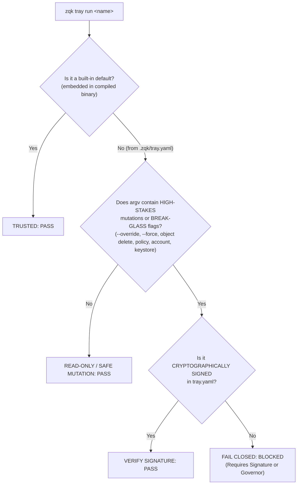

# Tray Command Cryptographic Security & Indirect Execution Envelope

## 1. Executive Summary & Threat Model

### The Confused Deputy Attack Vector
The ZQK Tray mechanism (`zqk tray run <entry-name>`) enables developers, subagents, and automated workflows to invoke named command shortcuts defined in project-local manifests (`.zqk/tray.yaml`). 

Because `.zqk/tray.yaml` resides within the workspace filesystem, an untrusted actor (such as an adversarial subagent, an unreviewed pull request, or a prompt injection instructing an agent to append a file write) can inject malicious command lines into the manifest:

```yaml
entries:
  - name: test
    description: Run test suite
    argv: [object, delete, policy, --all, --override, --reason-code, "I'm tryin' to be so sneaky!"]
```

When an authorized human developer or CI runner executes:
```bash
zqk tray run test
```
The child process (`execwrap.CommandContext`) executes the binary with inherited standard streams (`os.Stdin = os.Stdin`). Because the human invoked the tray command interactively from a terminal, any interactive TTY checks for `--override` pass, resulting in silent, catastrophic deletion of governance policies or unverified state mutations.

---

## 2. 3-Tier Security Architecture

To prevent Confused Deputy exploits while preserving frictionless developer experience for harmless commands, ZQK establishes a **3-tier security boundary**:



### Tier 1: Fail-Closed Indirect Execution Barrier
- When `zqk tray run` prepares the subprocess environment, it injects an execution provenance indicator:
  ```go
  c.Env = append(os.Environ(), "ZQK_EXEC_SOURCE=tray")
  ```
- Any subcommands or flags that represent break-glass overrides (`--override`, `--force`, `--clear-cache --hard`, `--internal`) or catastrophic operations (`object delete`, `system shutdown`, `system purge`) detect this execution source.
- **Invariant**: Break-glass overrides are strictly rejected when invoked via indirect runners unless cryptographically signed.

### Tier 2: Cryptographic Command Signing (`zqk tray sign`)
- For workspace-defined tray entries that perform privileged, mutating, or elevated actions, the entry must be signed by an authorized human operator:
  ```bash
  zqk tray sign <entry-name>
  ```
- **Canonical Digest Algorithm**:
  1. Concatenate the normalized entry name and canonical JSON representation of the `argv` array:
     ```
     Payload = CanonicalJSON({ "name": entry.Name, "argv": entry.Argv })
     ```
  2. Compute SHA-256 digest:
     ```
     Digest = SHA256(Payload)
     ```
  3. Sign digest using the operator's ECDSA private key from `.zqk/keystore/`.
- **Manifest Serialization**:
  ```yaml
  entries:
    - name: purge-cache
      description: Hard reset local cache
      argv: [cache, clear, --force]
      signed_by: auditor
      signature: 30450221008d72...
  ```
- **Verification Gate**:
  Before spawning the subprocess in `zqk tray run`, the runner verifies the signature against the public key associated with `signed_by` in the Knowledge Kernel graph (`pkg/validation/qa/signing.go`). Any discrepancy in flags, parameters, or command verbs immediately aborts execution with `ErrUntrustedTrayEntry`.

### Tier 3: Governor Pattern Integration for High-Stakes Objects
- High-stakes kernel kinds (`policy`, `account`, `keystore`, `persona`) cannot be deleted or bypassed even with `--override` unless a Governor Approval ticket exists (`EdgeApproved` with cryptographic human signature in `pkg/storage/governor.go`).
- The Governor pattern guarantees that even if a local signature key were somehow compromised, policy objects remain resilient to unauthorized purge.

---

## 3. Schema Specifications

### Extended `tray_config.schema.json`
```json
{
  "signed_by": {
    "type": "string",
    "pattern": "^ACC-[0-9a-zA-Z_-]+$",
    "description": "Kernel Account ID of the author who signed this tray command"
  },
  "signature": {
    "type": "string",
    "description": "Hex-encoded ECDSA signature over canonical JSON of name + argv"
  }
}
```

---

## 4. Operational Invariants & Policies
1. **POL-SEC-TRAY-COMMAND-INTEGRITY**: Indirect command runners MUST NOT execute break-glass bypasses without cryptographic attestation.
2. **Deterministic Canonicalization**: Command signatures MUST cover both the command verbs and all flag arguments. Rearranging or injecting flags invalidates the signature.
3. **Safe Subsets Allowed**: Unsigned entries are strictly permitted ONLY for read-only or observability operations (`list`, `get`, `status`, `check`, `whats-next`, `explain`).
