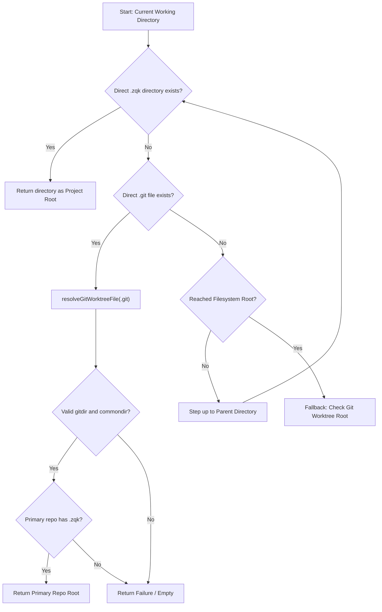

# Native Git Worktree Kernel Data Plane Resolution

## Overview
Git worktrees are a foundational primitive for high-throughput multi-agent execution, human-agent pair programming, and non-blocking background branch execution. However, secondary git worktrees do not contain a `.git` directory; instead, git generates a `.git` file containing `gitdir: <path-to-main-repo/.git/worktrees/<name>>`.

Furthermore, secondary worktrees often omit project-level metadata directories like `.zqk` (which are gitignored or uncommitted). Previously, running CLI commands or initializing storage engines from within a linked worktree or deep subdirectory could fail to locate the kernel data plane or escape the repository boundary into parent directories (e.g. `/tmp` or `/var/folders`).

The **Native Git Worktree Kernel Data Plane Resolution** engine resolves this impedance mismatch by parsing git worktree metadata pointers deterministically to bind secondary worktrees directly to the main repository's canonical `.zqk` data plane.

---

## Architectural Principles

1. **Git Boundary Containment**:
   - Upward filesystem traversal looking for `.zqk` stops strictly at repository boundaries (`.git` directory or `.git` pointer file).
   - Traversal must never escape outside the git boundary into parent host directories.
2. **Deterministic Pointer Disambiguation**:
   - When `.git` is a file with `gitdir: <path>`, the engine parses the pointer.
   - If the target git directory has a `commondir` file, the engine computes the primary repository root (`<commondir>/..`).
   - If `commondir` is absent or the path follows the canonical `<repo>/.git/worktrees/<name>` pattern, the engine extracts the primary repository root.
3. **Seamless Storage & CLI Integration**:
   - `paths.ResolveProjectRoot` automatically resolves the true kernel root when invoked from any worktree directory or subdirectory.
   - Any subsystem utilizing `paths.ResolveProjectRoot(cwd)` (including storage providers, object graph watchers, and CLI entry points) immediately gains seamless access to the shared kernel without duplicate initialization or manual `--project-root` flags.

---

## Component Layout

```
pkg/paths/
├── project_root.go                 # FindWorktreeProjectRoot, resolveGitWorktreeFile, FindWorkspaceRoot
├── worktree_project_root_test.go   # Unit test suite for linked worktree parsing and boundary containment
└── paths.go                        # Directory and file permission constants

pkg/storage/
└── worktree_resolution_test.go     # End-to-end integration test validating storage reads across real git worktrees
```

---

## Resolution Algorithm



---

## Verification & Conformance
- **Unit Suite**: `go test -v ./pkg/paths -run TestFindWorktreeProjectRoot_SimulatedLinkedWorktree`
- **Integration Suite**: `go test -v ./pkg/storage -run TestWorktreeKernelResolution_Integration`
  - Initializes real git repository.
  - Adds `.zqk` and `.gitignore`.
  - Creates secondary git worktree via `git worktree add`.
  - Verifies that `paths.ResolveProjectRoot` and `storage.NewFileObjectStorageForTest` query and retrieve kernel objects seamlessly from deep inside the secondary worktree.
