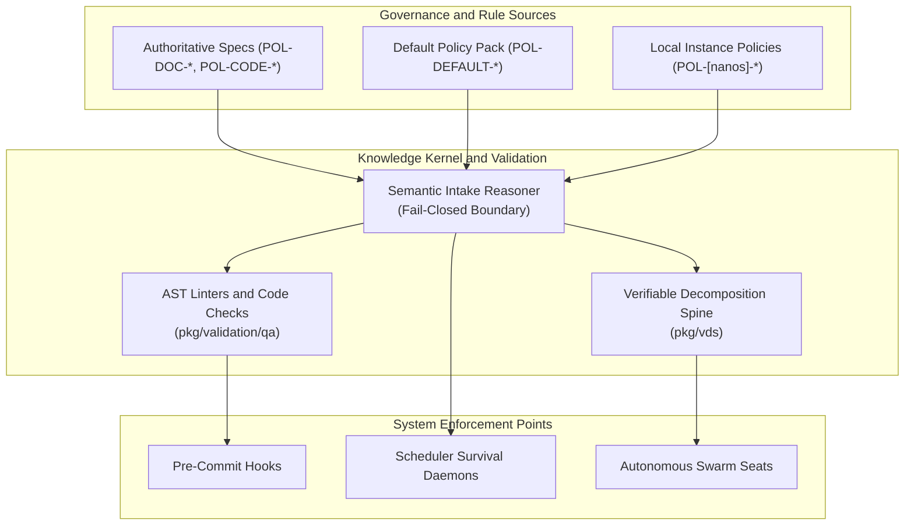
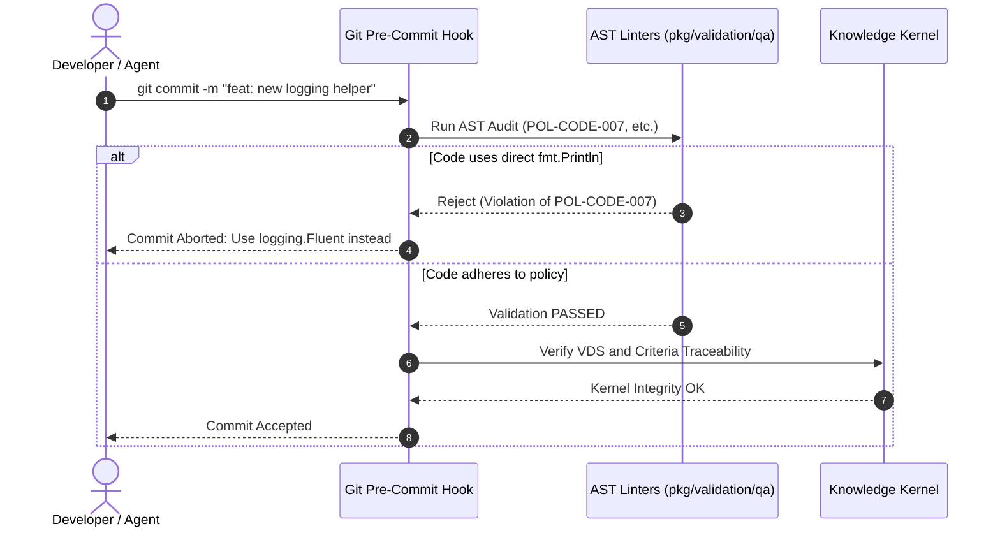

# Policy Governance, Durability, and Maintenance Conventions

In the ZQK Cellular Knowledge Operating System, policies (`kind: policy`) are first-class system objects that encode operational rules, code quality invariants, documentation standards, and agent swarm behaviors into the Knowledge Kernel graph.

This document defines the **authoritative taxonomy**, **cross-instance durability model**, and **development conventions** for creating, referencing, and maintaining policies across all ZQK environments.

---

## 1. Overview & Architectural Role

Policies serve as the immutable rulebook for both human engineers and autonomous agent swarms. Unlike passive text files or disconnected wiki pages, ZQK policies are:

- **Indexed & Queryable**: Stored as graph nodes within the Knowledge Kernel and queryable via `./bin/zqk object list policy` or the Model Context Protocol (MCP) mesh.
- **Fail-Closed Gateways**: Bound directly into compiler linters, intake reasoners (`pkg/intake/reasoner.go`), and git pre-commit hooks (`scripts/git-hooks/pre-commit`).
- **Cross-Instance Invariants**: Structured so that independent clones, developer laptops, CI/CD runners, and edge instances agree on policy semantics without centralized authority.



---

## 2. The Three Durability Tiers

To balance universal standardization with local flexibility, ZQK organizes policy identifiers into three distinct architectural tiers:

| Tier | Prefix Schema | Example Identifier | Durability Scope | Derivation Mechanism |
| :--- | :--- | :--- | :--- | :--- |
| **Tier 1: Specification Invariants** | `POL-<DOMAIN>-<NUM>` | `POL-DOC-001`, `POL-CODE-007` | **Universal** (all instances & nodes) | Hardcoded system RFC standard in code/linters. |
| **Tier 2: Seeded Default Policies** | `POL-DEFAULT-<16-hex>` | `POL-DEFAULT-37173b5595dc3bad` | **Cryptographically Deterministic** | `sha256("default-policy:" + lower(title))[:8]` |
| **Tier 3: Instance-Local Policies** | `POL-<nanos>-<8-hex>` | `POL-1789456123456-a1b2c3d4` | **Instance-Local** | Monotonic nanosecond timestamp + random hex. |

---

### Tier 1: Canonical Specification Invariants (`POL-<DOMAIN>-<NUM>`)

Tier 1 policies represent the constitutional invariants of the operating system. They are fixed identifiers referenced directly in Go source code, abstract syntax tree (AST) linters, and verification test suites.

#### Key Invariant Families

1. **Documentation Governance (`POL-DOC-*`)**:
   - `POL-DOC-001` (*Document Type Classification*): Enforces mandatory non-empty description attributes on all intake objects; missing descriptions are rejected fail-closed at the cellular membrane boundary.
   - `POL-DOC-002` (*Single Source of Truth*): Prohibits title and semantic collisions between documentation entries.
   - `POL-DOC-003` (*Document Archival Policy*): Regulates deprecation lifecycles and physical movement into `_archive` spaces.
   - `POL-DOC-004` (*Vendor-Neutral Primacy*): Mandates that canonical knowledge remains vendor-neutral, with vendor files (`AGENTS.md`, `CLAUDE.md`, `GEMINI.md`) functioning purely as projections.
   - `POL-DOC-005` (*Agent Pre-Flight Check*): Mandates consultation of `PROMPT-DOC-STEWARD-001` before modifying core documentation.

2. **Code Quality & Concurrency (`POL-CODE-*`)**:
   - `POL-CODE-004` (*Deterministic Waits*): Enforces bounded synchronization loops in async pipelines to prevent deadlocks.
   - `POL-CODE-006` (*Test Data Isolation*): Mandates ephemeral, sandboxed test fixtures with zero cross-test pollution.
   - `POL-CODE-007` (*Structured Logging Standard*): Prohibits raw `fmt.Print*` calls in production packages; all logging must use structured fluent builders (`logging.Fluent`).
   - `POL-CODE-011` (*String Literal Elimination*): Mandates typed constant identifiers over ad-hoc strings in storage operations.

3. **Workflow & Verification (`POL-WORKFLOW-*` / `POL-CLI-*`)**:
   - `POL-WORKFLOW-002` (*Plan-Scoped Integration Branches*): Requires that all deliverable work map to a priority plan and single feature/integration PR.
   - `POL-WORKFLOW-VDS` (*Verifiable Decomposition Spine*): Evaluates chunk contracts and automated acceptance rubrics.
   - `POL-CLI-001` (*CLI DNA & Taxonomy*): Enforces standard flag conventions, `--format json` support, and structured exit codes.

---

### Tier 2: Seeded Default Policies (`POL-DEFAULT-<sha256[:8]>`)

When a new repository or workspace is initialized (`./bin/zqk system init`), the system seeds a foundational policy pack into the Knowledge Kernel via `SeedDefaultPolicyPack` in `cmd/zqk/system/init_default_policies.go`.

#### Cryptographic Derivation Function

To ensure that independent ZQK instances compute identical identifiers without coordinating across a network, default policies derive their ID deterministically:

```go
func stableDefaultPolicyID(title string) string {
    sum := sha256.Sum256([]byte("default-policy:" + strings.ToLower(strings.TrimSpace(title))))
    return "POL-DEFAULT-" + hex.EncodeToString(sum[:8])
}
```

#### Why This Matters

- **Zero ID Collisions**: Re-running initialization is completely idempotent. If `POL-DEFAULT-37173b5595dc3bad` already exists, `SeedDefaultPolicyPack` skips creation cleanly.
- **Cross-Instance Graph Merging**: When repositories or sub-workspaces exchange objects via git or export bundles, their foundational policies align seamlessly because their cryptographic keys match.

---

### Tier 3: Instance-Local Dynamic Policies (`POL-<nanos>-<hex>`)

Teams and swarms frequently create custom operational policies for specific projects or domains.

When an agent or developer executes:
```bash
./bin/zqk object create policy \
  --title "Rust FFI Memory Boundary Rules" \
  --field "category=code_quality" \
  --field "policy_type=requirement" \
  --field "body=All unsafe Rust blocks interfacing with Go must be wrapped in isolated FFI crates."
```

If no explicit `--id` is supplied, the kernel mints a standard nanosecond-timestamped identifier (e.g., `POL-1789456123456-a1b2c3d4`). These policies are unique to that particular repository instance and participate in normal git versioning under `.zqk/process/`.

---

## 3. ID Prefix Registry Configuration

All recognized policy prefix patterns are centrally registered in two synchronized locations:

1. **Kernel Configuration**: `.zqk/specs/configs/id_prefixes_config.yaml`:
   ```yaml
   policy:
     - POL-CODE-
     - POL-SEC-
     - POL-DATA-
     - POL-OPS-
     - POL-ARCH-
     - POL-DEBUG-
     - POL-DOC-
     - POL-EST-
     - POL-FEATURE-
     - POL-MCP-
     - POL-ONBOARD-
     - POL-PLAN-
     - POL-TRACK-
     - POL-WORKFLOW-
     - POL-AGENT-
     - POL-OBS-
     - POL-DEFAULT-
   ```

2. **Go Core Validator**: `pkg/validation/id_prefixes_config.go` and `pkg/validation/id_validator_loading.go`.

This registry guarantees that `InferKindFromID("POL-DEFAULT-...")` and `InferKindFromID("POL-DOC-001")` immediately resolve to `kind: policy` in O(1) time without requiring disk I/O.

---

## 4. AST Linters and Automated Enforcement

Policy compliance is not left to manual code review. ZQK runs automated AST checks during pre-commit and scheduler maintenance runs:



### Example AST Rule Implementation: `POL-CODE-007`

In `pkg/validation/qa/ast_audit_fmt.go`:
```go
// Enforces POL-CODE-007: direct fmt.Print* or raw os.Stderr calls are prohibited outside allowed packages.
if sel.Sel.Name == "Println" || sel.Sel.Name == "Printf" {
    return Violation{
        RuleID:   "POL-CODE-007",
        Message:  fmt.Sprintf("POL-CODE-007 violation: direct %s call detected. Use logger.Info/Warn/Error or cli.WriteOutput.", sel.Sel.Name),
        Severity: SeverityError,
    }
}
```

---

## 5. Development Conventions & Best Practices

When adding new policies or modifying existing systems, follow these conventions:

### Rule 1: Never Hardcode Ephemeral Nanos IDs
- **Forbidden**: Hardcoding `POL-1789334232564133000-02789aa2` into Go code, documentation guides, or public CLI help outputs.
- **Allowed**: Referencing authoritative constants (`POL-DOC-001`, `POL-CODE-007`) or querying dynamic objects at runtime via `zqk object get <id>`.

### Rule 2: Explicit Titles and Mandatory Descriptions
Every policy must provide a clear, human-readable title and a concise semantic description explaining the rationale, failure mode, and remediation steps. Under `POL-DOC-001`, missing descriptions are rejected fail-closed.

### Rule 3: Use the Seed Pack for Multi-Node Standards
If you are introducing an organization-wide or product-wide policy intended to exist across all greenfield projects, add the YAML template to `scripts/default_policies/` with standard category attributes. The kernel will automatically seed it with a stable `POL-DEFAULT-<sha256[:8]>` ID during initialization.

### Rule 4: Verify with CLI Commands
Always verify policy objects using the canonical CLI:

```bash
# List all active policies in the repository
./bin/zqk object list policy

# Inspect a specific authoritative or seeded policy
./bin/zqk object get POL-DEFAULT-37173b5595dc3bad

# Check kernel integrity and policy invariants
./bin/zqk system kernel-integrity report
```
