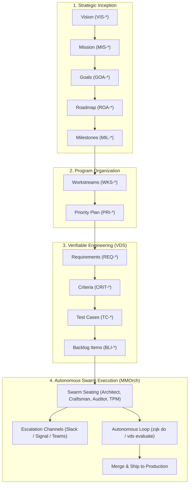

# From Vision to Code: Complete Multi-Agent Orchestration Walkthrough

<!-- tags: walkthrough, tutorial, getting-started, ontology, mmorch, swarm, orchestration, vision-to-code, escalation, slack, teams, vds, roadmap, criteria, test-cases -->

## Executive Summary

How do you take human desire—*"I want to build system X with expectations Y and constraints Z"*—and orchestrate an autonomous multi-agent swarm to design, implement, test, verify, and deliver it end-to-end with **near-zero human intervention**, while maintaining mathematical certainty that quality, budget, and security constraints are never violated?

This walkthrough depicts the canonical lifecycle of an engineering initiative within the **ZQK Knowledge Operating System (KOS)**. It shows how the Knowledge Kernel's typed objects transform unstructured human intent into verifiable, automated execution.



---

## The Scenario

- **The Vision:** Build **"IngestStream"**, a distributed resilient event ingestion pipeline.
- **Expectations (Y):** Ingest 50,000 events/second with sub-100ms p99 latency, zero event loss across node restarts, and comprehensive OpenTelemetry tracing.
- **Constraints (Z):** Strict memory budget (≤ 512MB RAM), zero non-standard dependencies, Ed25519 payload signing, and fail-closed authentication.

---

## Phase 1: Strategic Inception (Vision, Mission, Goals)

Instead of dumping natural language into an ephemeral agent prompt, the human operator initializes the strategic foundation directly into the repository's Knowledge Kernel.

### 1.1 Establish the Vision (`VIS-001`)
```bash
zqk object create vision \
  --title "IngestStream: Zero-Loss Distributed Telemetry Pipeline" \
  --description "High-throughput, tamper-evident ingestion pipeline providing sub-100ms telemetry processing under resource-constrained environments."
```

### 1.2 Formulate the Mission (`MIS-001`)
```bash
zqk object create mission \
  --title "Deliver IngestStream v1 Core Engine" \
  --description "Ship an out-of-the-box streaming engine achieving 50k events/sec with verified Ed25519 signing and fail-closed security gates by Q4." \
  --vision-ref VIS-001
```

### 1.3 Declare High-Level Strategic Goals (`GOA-001`)
```bash
zqk object create goal \
  --title "Low-Latency High-Volume Event Ingestion Substrate" \
  --description "Establish the zero-copy buffer pool and async write pipeline capable of 50k events/sec under 512MB memory ceiling." \
  --mission-ref MIS-001 \
  --priority-tier P0
```

> [!NOTE]
> **Anti-Inflation Rule**: Notice that we do *not* create a goal for every component. `GOA-001` represents the entire technical capability. All subsequent milestones and requirements will anchor directly to this single goal.

---

## Phase 2: Program Architecture & Gantt Runway (Roadmap & Priority Plan)

A roadmap frames the timeline; workstreams organize long-lived technical lanes; priority plans define concrete execution phases.

### 2.1 Anchor the Roadmap & Milestones
```bash
# 1. Create the system roadmap
zqk object create roadmap \
  --title "IngestStream Engine Roadmap 2026" \
  --goal-refs GOA-001

# 2. Establish verifiable milestone
zqk object create milestone \
  --title "Milestone 1: Core Ring Buffer & Storage Pipeline Verified" \
  --deadline "2026-11-15T00:00:00Z" \
  --goal-ref GOA-001
```

### 2.2 Create the Execution Priority Plan (`PRI-INGEST-001`)
```bash
zqk object create priority_plan \
  --title "Priority Plan: IngestStream RingBuffer Storage Engine" \
  --description "Design, implement, benchmark, and secure the zero-copy ring buffer with Ed25519 cryptographic payload verification." \
  --milestone-ref MIL-001 \
  --status active
```

---

## Phase 3: Verifiable Engineering Specification (VDS)

Now we translate architectural goals into **objectively verifiable engineering units**. 

### 3.1 Declare the Formal Requirement (`REQ-INGEST-001`)
```bash
zqk object create requirement \
  --title "Zero-Copy Event Ring Buffer Memory Hygiene" \
  --description "The ingestion engine must allocate a fixed pre-warmed ring buffer bounded at 256MB that never triggers GC churn under peak load." \
  --priority-plan-ref PRI-INGEST-001 \
  --priority-tier P0
```

### 3.2 Define Objective Acceptance Criteria (`CRIT-*`)
Criteria represent mathematically provable conditions, not subjective prose:

```bash
# Criterion 1: Throughput and latency benchmark
zqk object create criteria \
  --title "Throughput >= 50k evt/sec with p99 <= 100ms" \
  --description "Automated benchmark suite must sustain 50,000 synthetic events/sec for 10 consecutive minutes with p99 latency <= 100ms." \
  --requirement-ref REQ-INGEST-001 \
  --validation-method automated_test \
  --validation-threshold "50000_eps_100ms"

# Criterion 2: Memory Ceiling Compliance
zqk object create criteria \
  --title "Memory Allocation <= 512MB RAM" \
  --description "Resident set size (RSS) during peak benchmark must not exceed 512MB as verified by system resource samplers." \
  --requirement-ref REQ-INGEST-001 \
  --validation-method metric_threshold \
  --validation-threshold "512MB_RSS"
```

### 3.3 Link Specification Test Cases (`TC-*`)
```bash
zqk object create test_case \
  --title "BenchmarkIngestStreamThroughput" \
  --description "Go benchmark testing concurrent buffer push and pop operations under simulated network backpressure." \
  --criteria-refs CRIT-INGEST-001,CRIT-INGEST-002 \
  --execution-path "pkg/ingest/benchmark_test.go"
```

### 3.4 Package Cohesive Backlog Items (`BLI-*`)
> [!IMPORTANT]
> **Anti-Inflation Discipline**: Do not create 20 micro-tickets for individual functions. Create cohesive, end-to-end deliverable units:

```bash
zqk object create backlog_item \
  --title "Implement Core Zero-Copy RingBuffer & Lock-Free Writer" \
  --description "Deliver pkg/ingest/ringbuffer.go with concurrent atomic pointers, pre-warmed buffer pools, and automated benchmark verification." \
  --priority-plan-ref PRI-INGEST-001 \
  --requirement-ref REQ-INGEST-001 \
  --criteria-refs CRIT-INGEST-001,CRIT-INGEST-002 \
  --priority-tier P0
```

---

## Phase 4: Massively Multi-Agent Swarm Orchestration (MMOrch)

With the verifiable ontology locked in the kernel, we seat the autonomous agent swarm.

### 4.1 Swarm Topology & Persona Seating

The swarm manifest (`swarm.yaml`) defines four specialized roles that collaborate asynchronously:

```yaml
version: "1.0.0"
swarm:
  id: "SWARM-INGEST-STREAM"
  seats:
    - id: "seat-tpm"
      role: "TPM Coordinator"
      persona_ref: "PER-COMMUNITY-TPM"
      responsibilities: ["Gantt matrix monitoring", "Priority plan gating", "Branch lifecycle"]
    - id: "seat-architect"
      role: "System Architect"
      persona_ref: "PER-COMMUNITY-ARCHITECT"
      responsibilities: ["Data structures", "Package boundaries", "Zero-alloc contracts"]
    - id: "seat-craftsman"
      role: "Code Craftsman"
      persona_ref: "PER-COMMUNITY-CRAFTSMAN"
      responsibilities: ["TDD implementation", "Algorithm optimization", "PR staging"]
    - id: "seat-auditor"
      role: "QA Auditor"
      persona_ref: "PER-COMMUNITY-QA"
      responsibilities: ["Benchmark execution", "Criteria verification", "VDS sign-off"]
```

### 4.2 Proactive Escalation & Notification Paths

Autonomous swarms run without human micromanagement, but **must fail closed and notify humans immediately upon anomaly or policy breach**:

```yaml
escalation:
  channels:
    slack:
      webhook_url_env: "SLACK_ALERTS_WEBHOOK"
      channel: "#eng-swarm-alerts"
      notify_on: ["BLOCKING_VIOLATION", "BUDGET_EXCEEDED", "BENCHMARK_REGRESSION"]
    signal:
      recipient_group: "Platform-Leads"
      notify_on: ["SECURITY_GATE_BREACH", "EMERGENCY_HALT"]
    teams:
      webhook_url_env: "TEAMS_ALERTS_WEBHOOK"
      notify_on: ["PRIORITY_PLAN_COMPLETE"]

  policies:
    # If benchmark regressions exceed 15%, halt loop and page human architect
    benchmark_drift_tolerance: 0.05
    # If non-retryable errors occur > 3 times, escalate to Slack
    max_unassisted_remedies: 3
```

---

## Phase 5: Autonomous Execution Loop (`zqk do`)

The Craftsman and Auditor agents execute using the single-command execution loop:

```bash
# 1. Craftsman claims and implements the work
zqk do "implement BLI-INGEST-001: deliver zero-copy ringbuffer"

# 2. Automated test execution & criteria measurement
zqk test run --criteria CRIT-INGEST-001,CRIT-INGEST-002

# 3. VDS Definition-of-Done Evaluation
zqk workflow vds evaluate --format json
```

### Verification & Autonomous Delivery
1. The **Auditor Agent** validates that benchmark outputs meet both criteria (`52,400 evt/sec`, `380MB RAM`).
2. The **TPM Agent** verifies that all Definition of Done gates pass and issues a cryptographic `qa_success` attestation stamp.
3. The branch is pushed, a Pull Request is opened automatically (`zqk system sync --create-pr`), and squashed into `main`.
4. The system emits a completion event to `#eng-swarm-alerts` via Slack webhook:
   > 🚀 **IngestStream RingBuffer Storage Engine Complete**: 52.4k evt/sec verified. Zero human intervention required during execution.

---

## Conclusion & Best Practices

1. **Root Everything in the Kernel**: Human desires must become typed kernel objects (`vision`, `goal`, `requirement`), not chat transcript ephemeral context.
2. **Resist 1:1 Object Sprawl**: A small constellation of high-altitude objects is far more valuable and maintainable than 100 trivial line-by-line objects.
3. **Automate the DoD Gates**: If a criterion cannot be tested deterministically by a machine, rephrase it until it can.
4. **Arm Escalation Channels Early**: Give agents clear guardrails (Slack/Signal webhooks) so you can step away with confidence that anomalies will notify you instantly.
