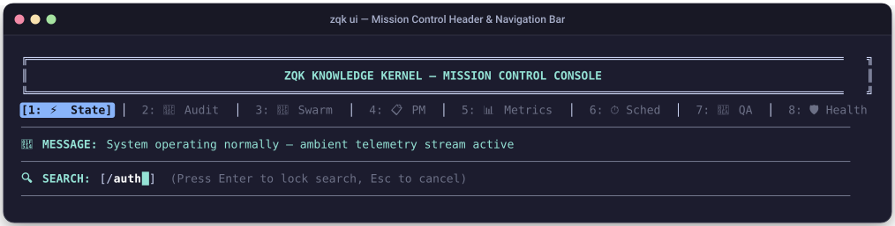
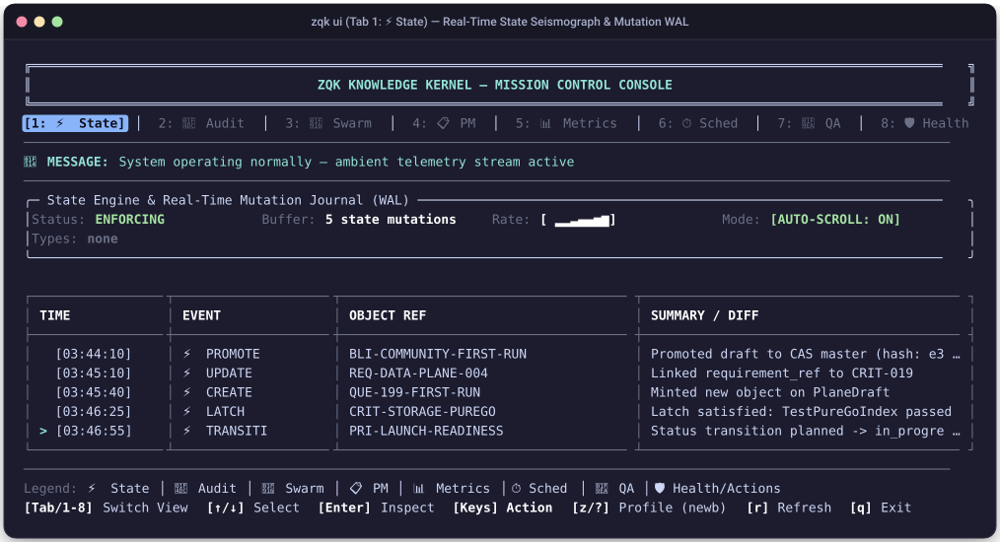
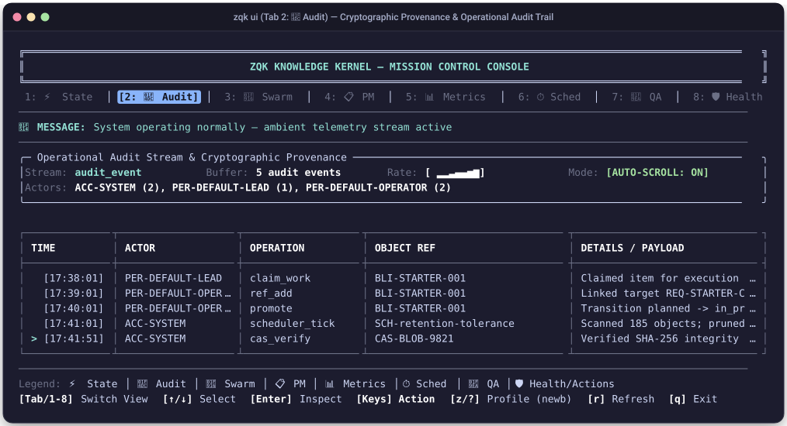
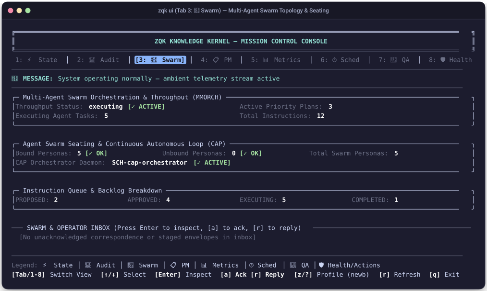
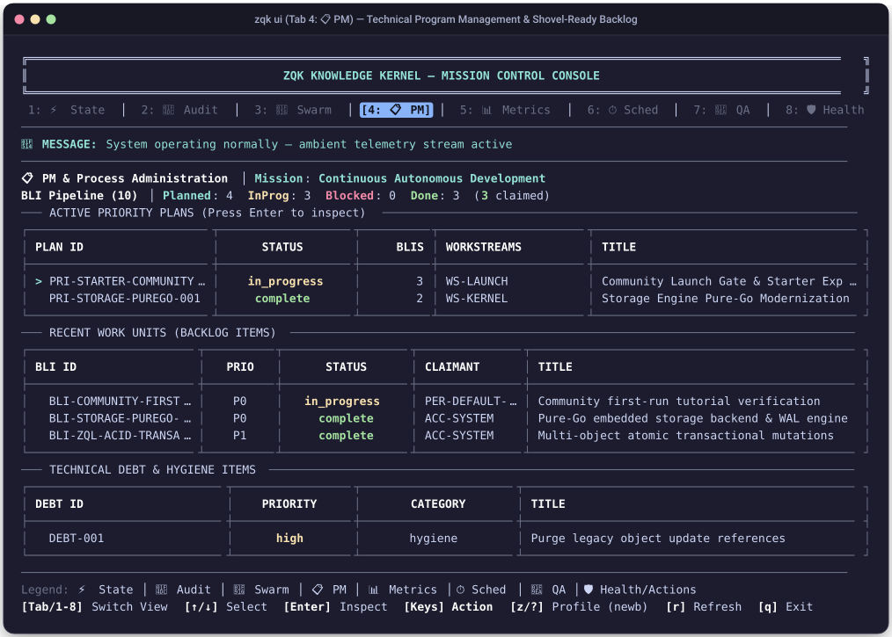
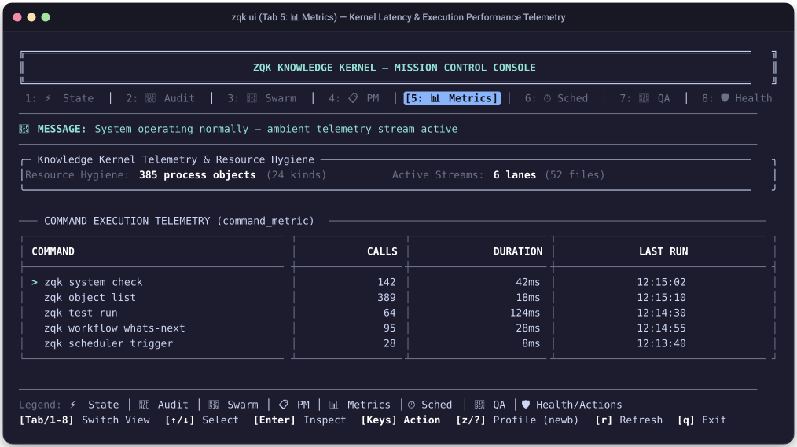
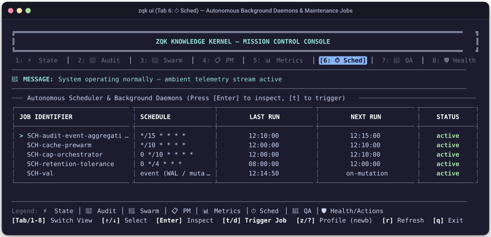
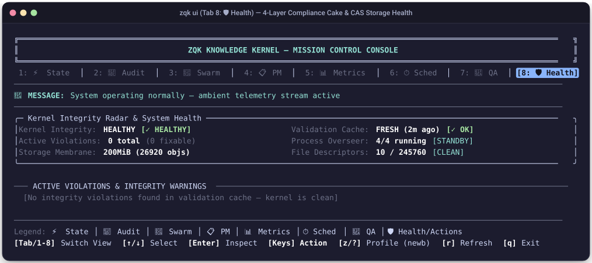

# Manual: Mission Control TUI, Web Studio & Diagnostics Visual Guide

This visual guide documents the full interface layout, visual components, interactive hotkeys, and data interpretations for the **ZQK Mission Control Console (`zqk ui`)**, **Visual Web Studio (`zqk ui -w`)**, and **Test Verification Dashboard (`zqk test dashboard`)**.

---

## 1. System Navigation & Header Anatomy

When launched in a terminal (`zqk ui`), Mission Control renders a responsive ANSI terminal user interface (TUI). 

### Visual Terminal Screenshot: Header & Navigation Bar

### Datapoint Breakdown & Operator Guidance:

| Datapoint / Component | Visual Format | Semantic Meaning | Why It Is Useful & Action Required |
| :--- | :--- | :--- | :--- |
| **Active Tab** | Reverse video `[1: ⚡ State]` | Indicates the currently active telemetry projection. | Use number keys `[1]`–`[8]` or `[Tab]` / `[Shift+Tab]` to cycle views instantly. |
| **Editor Profile** | `newb` / `pro` / `jedi` | Display density profile. Press `[z]` to cycle. | `newb` shows full borders; `pro` compresses into 1-line top bar; `jedi` maximizes screen rows for high-density monitors. |
| **Dynamic Message Line** | `🔔 MESSAGE: <status>` | Real-time ambient status accumulator and alert banner. | Green `✓` means normal; Yellow `⚡`/`⏳` indicates background compaction or sync; Red `✗` indicates blocked work or broken invariants. |
| **Interactive Search Buffer** | `🔍 SEARCH: [/<query>█]` | In-memory substring filter active across current tab rows. | Press `[/]` to enter search query, `[Enter]` to commit, `[n]`/`[N]` to jump between matches, `[Esc]` to clear. |

---

## 2. Tab 1: ⚡ State (Real-Time State Seismograph & Mutation Journal)

The State Tab provides a real-time seismograph of kernel mutations flowing through the change journal Write-Ahead Log (WAL).

### Visual Terminal Screenshot: Tab 1

### Datapoint Breakdown & Operator Guidance:

| Datapoint / Component | Visual Format | Semantic Meaning | Why It Is Useful & Action Required |
| :--- | :--- | :--- | :--- |
| **Status Badge** | Green bold `Status: ENFORCING` | Kernel admission controller policy enforcement status. | Confirms all incoming mutations pass structural schema validation and invariant checks. |
| **Buffer Counter** | `Buffer: 5 state mutations` | Total count of mutations retained in memory journal buffer. | Monitors WAL buffer depth before disk sync or memory compaction. |
| **Rate Sparkline** | `Rate: [ ▂▂▃▄▄▅▆]` | Moving 60-second mutation frequency across all active planes. | Spikes indicate heavy autonomous swarm ingestion or batch commits. |
| **Auto-Scroll Mode** | `[AUTO-SCROLL: ON]` / `[PAUSED: +N]` | Viewport tracking behavior for the live event stream. | Press `[Space]` or `[↑]` to pause live tracking and inspect specific records; press `[Space]` to resume. |
| **Types Counter** | `Types: none` / `BLI: 3, REQ: 1` | Per-kind event breakdown across the current buffer. | Quickly shows which entity types are undergoing rapid evolution. |
| **Event Badges** | `⚡ PROMOTE`, `⚡ UPDATE`, `⚡ CREATE`, `⚡ LATCH`, `⚡ TRANSITION` | Mutation category and state plane membrane transition. | `PROMOTE` marks graduation from draft to CAS master; `LATCH` marks test criterion satisfaction; `CREATE` mints new entities. |
| **Cursor Marker** | `> [TIME]` (Cyan bold) | Currently selected row in the mutation stream. | Navigate with `[↑]`/`[↓]`; press `[Enter]` to open the 7-panel modal inspector for this object. |

---

## 3. Tab 2: 📜 Audit (Operational Audit Log & CAS Cryptographic Provenance)

The Audit Tab provides non-repudiable audit logs tracking which human or AI agent performed each action.

### Visual Terminal Screenshot: Tab 2

### Datapoint Breakdown & Operator Guidance:

| Datapoint / Component | Visual Format | Semantic Meaning | Why It Is Useful & Action Required |
| :--- | :--- | :--- | :--- |
| **Stream Channel** | Cyan bold `Stream: audit_event` | Dedicated high-volume operational audit stream channel. | Disambiguates audit logs from domain object mutations. |
| **Buffer Depth** | `Buffer: 5 audit events` | Count of cryptographic audit records retained in active ring buffer. | High volume indicates active multi-agent pipeline activity. |
| **Actor Breakdown** | `Actors: ACC-SYSTEM (2), PER-DEFAULT-LEAD (1), PER-DEFAULT-OPERATOR (2)...` | Aggregate event counts grouped by caller persona or daemon. | Detects unbalanced actor activity, runaway agent loops, or rogue background workers. |
| **Actor Badge** | `PER-DEFAULT-LEAD`, `ACC-SYSTEM`, `PER-DEFAULT-OPERATOR` | Cryptographically attributed identity of the actor initiating the operation. | Non-repudiation tracking for governance, security audits, and multi-agent coordination. |
| **Operation Column** | `claim_work`, `ref_add`, `promote`, `scheduler_tick`, `cas_verify` | Fine-grained API mutation verb executed against the kernel. | Audits exact command actions; helps identify failed assertions or unauthorized mutation attempts. |
| **Cryptographic Provenance** | Row selection `[Enter]` | Opens complete JSON modal displaying SHA-256 CAS hash, parent hash, and timestamp. | Verify immutable cryptographic provenance before signing off on release candidates. |

---

## 4. Tab 3: 🤖 Swarm (Multi-Agent Swarm Topology & Seating)

The Swarm Tab visualizes running agent processes, seated roles, active task assignments, and message queues.

### Visual Terminal Screenshot: Tab 3

### Datapoint Breakdown & Operator Guidance:

| Datapoint / Component | Visual Format | Semantic Meaning | Why It Is Useful & Action Required |
| :--- | :--- | :--- | :--- |
| **Throughput Status** | Green bold `executing [✓ ACTIVE]` | Live state of the continuous autonomous multi-agent loop (CAP). | Verifies that the autonomous execution engine is actively driving backlog delivery. |
| **Active Priority Plans** | Numeric count `3` | Number of active priority plans currently being executed by swarm agents. | Confirms program alignment and active workstream progress. |
| **Executing Tasks** | Numeric count `5` | Concurrently executing agent instructions and holon work units. | Quantifies swarm parallelism across the workspace. |
| **Total Instructions** | Numeric count `12` | Total instruction messages queued, in-flight, or latched in the swarm. | Tracks task pipeline depth; warns if work queue is starving or congested. |
| **Bound Personas** | `Bound Personas: 5 [✓ OK]` | Count of agent personas with valid skills and tools attached. | Unbound personas indicate misconfigured seating; run `zqk system agent-onboard` to repair. |
| **CAP Orchestrator** | `SCH-cap-orchestrator [✓ ACTIVE]` | Background CAP orchestrator daemon status. | Drives autonomous work claiming, evaluation, and progression without human intervention. |
| **Instruction Queue** | `PROPOSED`, `APPROVED`, `EXECUTING`, `COMPLETED` | State distribution of agent instruction objects. | Monitors throughput bottlenecks across the instruction lifecycle. |
| **Managed Daemons** | `ambient`, `privileged-writer`, `scheduler`, `steward` | Process table showing PID, uptime, restart counts, and health. | Restart count > 0 indicates crashes or OOM; triage with `zqk system check --details`, `zqk scheduler health-check`, or `zqk feed doctor`. |

---

## 5. Tab 4: 📋 PM (Gantt Matrix, Workstreams & Priority Plans)

The PM Tab displays the Technical Program Management (TPM) Gantt matrix and backlog status breakdown.

### Visual Terminal Screenshot: Tab 4

### Datapoint Breakdown & Operator Guidance:

| Datapoint / Component | Visual Format | Semantic Meaning | Why It Is Useful & Action Required |
| :--- | :--- | :--- | :--- |
| **Mission Alignment** | `Mission: Continuous Autonomous Development` | Top-level organizational mission guiding autonomous program execution. | Root intent node anchored in the knowledge kernel graph. |
| **BLI Pipeline Vitals** | `Pipeline (10)`, `Planned: 4`, `InProg: 3`, `Blocked: 0`, `Done: 3` | Global delivery breakdown of all backlog items in the active priority plans. | Highlights pipeline bottlenecks and claimant saturation across the swarm. |
| **Priority Plans Table** | `PLAN ID`, `STATUS`, `BLIS`, `WORKSTREAMS`, `TITLE` | Active priority plans grouping strategic milestones and workstreams. | Press `[Enter]` to inspect plan details, causal dependency tree, and deliverable runway. |
| **Runway Depth** | Shovel-ready count in `BLIS` | Number of unblocked backlog items ready for immediate claiming. | Runway depth `<= 1` triggers TPM replenishment warnings. |
| **Priority Tiers** | `P0` (Critical), `P1` (Core deliverable), `P2` (Polish), `P3` (Hygiene) | Strict precedence tier for swarm work selection. | Swarm agents must strictly claim P0 items before grooming lower tiers. |
| **Work Units Table** | `BLI ID`, `PRIO`, `STATUS`, `CLAIMANT`, `TITLE` | Shovel-ready backlog items ready for or currently under autonomous execution. | Select and press `[Enter]` to drill down into acceptance criteria and test cases. |
| **Technical Debt Table** | `DEBT ID`, `PRIORITY`, `CATEGORY`, `TITLE` | Code hygiene, deprecated references, and cleanup tasks. | Ensures engineering hygiene items are addressed systematically between feature milestones. |

---

## 6. Tab 5: 📊 Metrics (Kernel Vitals & Subsystem Telemetry)

The Metrics Tab reports operational telemetry, execution latencies, and cache efficiency.

### Visual Terminal Screenshot: Tab 5

### Datapoint Breakdown & Operator Guidance:

| Datapoint / Component | Visual Format | Semantic Meaning | Why It Is Useful & Action Required |
| :--- | :--- | :--- | :--- |
| **Resource Hygiene** | `385 process objects`, `24 kinds`, `52 files`, `6 lanes` | Low-level storage and kernel process layer footprint. | Monitors disk usage and stream file growth in `.zqk/process/`. |
| **Command Telemetry** | `COMMAND`, `CALLS`, `DURATION`, `LAST RUN` | High-resolution latency profiling of CLI and API commands. | Identifies slow operations indicating lock contention or missing indices. |
| **Duration Metric** | `42ms`, `18ms`, `124ms`, `28ms`, `8ms` | Mean wall-clock duration per command invocation. | A shift in P99 latency past 250ms indicates file lock contention or heavy unindexed traversals. |
| **Cache Hit Rates** | Percentage badge in telemetry | Hit rate on the in-memory Schema Registry and object index. | Hit rates below 80% indicate redundant spec reloading; run `zqk system check` to verify index health. |
| **CAS File Locks** | `Target Kind`, `Contention Count`, `Duration`, `Status` | File lock contention and wait times for CAS and change journals. | High contention indicates simultaneous uncoordinated writers; review daemon concurrency. |

---

## 7. Tab 6: ⏱️ Sched (Scheduler Daemons & Maintenance Jobs)

The Sched Tab monitors autonomous background jobs, self-healing timers, and retention sweeps.

### Visual Terminal Screenshot: Tab 6

### Datapoint Breakdown & Operator Guidance:

| Datapoint / Component | Visual Format | Semantic Meaning | Why It Is Useful & Action Required |
| :--- | :--- | :--- | :--- |
| **Job Identifier** | `SCH-001` through `SCH-005` | Registered cron or interval maintenance jobs. | Primary daemon tasks responsible for self-healing and data integrity. |
| **Schedule Expression** | `@every 5m`, `@every 1h`, `@every 6h`, `@every 1m` | Configured trigger interval or cron expression. | Ensures compaction, audit aggregation, and hygiene sweeps execute predictably. |
| **Last Run / Next Run** | Timestamps `12:10:00` / `12:15:00` | Execution timing tracking daemon cadence. | If `Next Run` is in the past, daemon is frozen; restart with `zqk scheduler stop && zqk scheduler start`. |
| **Job Status** | Green bold `active` / Red bold `failed` | Health state of the scheduled maintenance job. | Press `[t]` to trigger immediate manual execution; press `[d]` to delay execution by 10s. |
| **Compaction Job** | `change_journal_compaction` | Compresses historical journal entries into immutable CAS chunks. | Prevents change journal files from exceeding the 10MB memory-mapped ceiling. |
| **Memory Watchdog** | `memory_leak_watchdog` | Monitors RSS footprint of running agent holons and daemons. | Automatically triggers graceful recycling if a daemon exceeds 512MB RAM. |

---

## 8. Tab 7: 🧪 QA (Definition of Done & Verification Radar)

The QA Tab provides full downward traceability verification: proving every backlog item is grounded in verifiable test cases and acceptance criteria.

### Visual Terminal Screenshot: Tab 7

### Datapoint Breakdown & Operator Guidance:

| Datapoint / Component | Visual Format | Semantic Meaning | Why It Is Useful & Action Required |
| :--- | :--- | :--- | :--- |
| **Traceability DoD** | `0%` – `100% [PENDING / MET]` | Mathematical percentage of acceptance criteria satisfied by test suites. | Strict gate: code cannot graduate to stable without 100% DoD satisfaction. |
| **Intact Chains** | `N / M [INTACT / BROKEN]` | Causal lineage chains connecting Goals ➔ REQs ➔ BLIs ➔ TSTs ➔ CRITs. | Broken chains indicate orphaned requirements or floating tests; run `zqk test bind` to link. |
| **Unbound Criteria** | `0 [✓ OK]` | Acceptance criteria lacking binding test case implementations. | Must be 0 for release readiness. |
| **BLI Coverage Bar** | `[░░░░░░░░] 0%` – `[████████] 100%` | Graphical progress bar indicating test coverage over active backlog items. | Provides at-a-glance delivery confidence. |
| **Lineage Badge** | `✓ INTACT` vs `✗ BROKEN` | Cryptographically latched requirement-to-test lineage. | Fails VDS Done-Gate if any chain is `✗ BROKEN`. |
| **Criteria Counter** | `1/1 ok`, `3/3 ok` | Ratio of latched criteria to total required criteria for this test case. | All criteria must be `ok` before PR merge is permitted. |
| **Test Suites Table** | `TEST CASE ID`, `STATUS`, `LINEAGE`, `CRITERIA`, `TITLE` | Downward traceability matrix showing all verified test functions. | Press `[t]` to trigger re-scan; press `[Enter]` to inspect test definition and criteria. |

---

## 9. Tab 8: 🛡️ Health (Kernel Storage & Membrane Integrity)

The Health Tab reports storage plane consistency, filesystem watcher health, and lock state.

### Visual Terminal Screenshot: Tab 8

### Datapoint Breakdown & Operator Guidance:

| Datapoint / Component | Visual Format | Semantic Meaning | Why It Is Useful & Action Required |
| :--- | :--- | :--- | :--- |
| **Overall Status** | Green bold `HEALTHY` / Yellow `DEGRADED` | Unified health verdict across all 4 layers of the compliance cake. | If degraded or unhealthy, inspect violations table below for remediation steps. |
| **Freshness Indicator** | `FRESH (2m ago)` | Time elapsed since last full kernel integrity scan. | Yellow or red warnings indicate stale diagnostics; run `zqk system check` to refresh. |
| **Storage Vitals** | `26,920 files`, `200MiB` | Content-Addressable Storage (CAS) blob volume and disk footprint. | Detects runaway blob leaks or storage bloat. |
| **File Descriptors** | `10 / 245,760 open [CLEAN]` | Operating system file descriptor consumption. | Guards against file descriptor leaks during intense concurrent operations. |
| **Process Overseer** | `4/4 running [STANDBY]` | Status of daemon overseer maintaining background services. | Overseer guarantees background daemons automatically respawn if terminated. |
| **Storage Membrane** | `200MiB (26920 objs)` | Authoritative CAS store size and object count. | Runbook [`RB-CAS-001`](../runbooks/RB-CAS-001-CAS-CORRUPTION-RECOVERY.md) applies if hash mismatch occurs. |
| **Active Violations** | `0 total (0 fixable)` | Count of structural or ontological invariant failures. | Must remain 0; any non-zero count triggers fail-closed execution locks. |

---

## 10. The Test Verification Dashboard (`zqk test dashboard`)

For dedicated CI/CD runs and local terminal verification, `zqk test dashboard --check-dod` provides a live stream of test execution and criteria latches.

### Visual Terminal Screenshot: Test Dashboard

### Datapoint Breakdown & Operator Guidance:

| Datapoint / Component | Visual Format | Semantic Meaning | Why It Is Useful & Action Required |
| :--- | :--- | :--- | :--- |
| **Target Line** | `Target: TestPureGoIndex (unit)` | Test function name, file path, and testing category (`unit`, `integration`, `e2e`). | Pinpoints exact test execution context and isolation boundaries. |
| **Criteria Pills** | `[🟢 CRIT-STORAGE-PUREGO]` | Real-time criteria latch states evaluated during test execution. | Green indicates verified; yellow indicates testing; red indicates failure. |
| **Chain Graduation** | `[REGRESSION POOL]` badge | Automatic promotion of satisfied test cases into the regression pool. | Prevents redundant test execution and keeps CI/CD test passes rapid. |
| **DoD Compliance** | Progress counter `[3/3 criteria latched]` | Overall Definition of Done satisfaction for the active branch. | When 100%, branch passes pre-merge validation gate. |

---

---

## 11. Visual Web Studio (`zqk ui -w` at http://127.0.0.1:8080)

When launched with the `-w` flag (`zqk ui -w`), ZQK starts a zero-dependency HTTP server embedded directly in the core binary, providing browser-based interactive exploration across two distinct projections:
1. **Chronological Timeline & Gantt Roadmap (`/studio/gantt`)**: Technical Program Management (TPM), milestone gates, swimlane groupings, and execution schedules.
2. **Ontology & Causal Dependency DAG Visualizer (`/studio/dag-visualizer`)**: Directed acyclic graph exploring upstream goals down to cryptographic acceptance criteria.

---

### 11.1 View 1: Timeline & Gantt Roadmap (`/studio/gantt`)

The Timeline & Gantt view projects the Knowledge Kernel's strategic roadmap along a continuous chronological timeline. It groups work by workstreams, anchors progress against the current day, and visualizes milestone delivery gates.

#### Visual Web Studio Screenshot: Timeline & Gantt View

#### Datapoint Breakdown & Operator Guidance:

| UI Component / Datapoint | Visual Location | Semantic Meaning | Diagnostic Value & Operator Action |
| :--- | :--- | :--- | :--- |
| **View Switcher Tabs** | Header (Center-Left) | Toggles between `☊ DAG Graph` and `▤ Timeline & Gantt`. | Click to switch instantly between topological graph view and chronological time projection without losing active node focus. |
| **Status Filter Pills** | Sub-Toolbar (Left) | Interactive status toggles: `[All]`, `[In Progress]`, `[Planned]`, `[Completed]`. | Filters visible Gantt rows. Click `[In Progress]` during daily standups to isolate active work units across all workstreams. |
| **Grouping Selector** | Sub-Toolbar (Center) | Dropdown menu: `Workstream`, `Priority Plan`, `Milestone`. | Restructures timeline swimlanes. Default `Workstream` groups tasks into top-level themes (`WS-CORE-LAUNCH`, `WS-STORAGE`). |
| **Task Counter** | Sub-Toolbar (Right) | Badge reporting visible item count (e.g. `8 items`). | Confirms the total quantity of roadmap entities matching active filter criteria. |
| **Interactive Legend Bar** | Top Bar | Defines visual markers: `◆ Milestone` (Orange), `🌐 Workstream` (Blue), `▶ In Progress` (Blue), `⏳ Planned` (Gray), `✓ Completed` (Green), `| Today Line` (Red). | Reference guide for reading roadmap entity types and completion states at a glance. |
| **Calendar Axis & Day Ticks** | Header Grid (Top) | Seven-day continuous calendar axis with weekday sub-labels (`Sep 26 Sat` to `Oct 02 Fri`). | Provides temporal grounding for work estimates. Grid columns expand proportionally across available browser viewport width. |
| **Vertical "Today" Line** | Full Canvas Height | High-contrast red dashed vertical line (`#f85149`) with `TODAY` badge at top. | Anchors current time. Items strictly to the left of the line represent past deliverables; items bisected by the line are in-flight; items to the right are future runway. |
| **Swimlane Section Headers** | Timeline Canvas | Dark container bars grouping related items (e.g. `🌐 WS-CORE-LAUNCH (4 items)`). | Visually segregates distinct architectural initiatives and displays aggregate task count per workstream. |
| **Milestone Diamond Markers** | Timeline Grid | High-visibility diamond glyphs (`◆` in `#f0883e`) aligned to deadline dates. | Critical strategic release gates (e.g. `MIL-COMMUNITY-LAUNCH`). Shows `✓ Achieved` when all constituent priority plans and criteria latch complete. |
| **Horizontal Gantt Progress Bars** | Timeline Grid | Rounded task bars spanning start date to target completion date. | Bar length reflects scheduled duration; inner text indicates completion percentage (e.g. `▶ 75% complete`) or state (`✓ complete`). |
| **Interactive Selection Highlight** | Timeline Row | Blue vertical accent bar and glowing background tint on selected row. | Clicking any row highlights its bar and automatically populates the right-hand **Gantt Inspector** drawer. |
| **Gantt Inspector Drawer** | Right Sidebar (372px) | Expandable detail panel showing selected entity's metadata, duration, parent milestone, downward backlog chain, and action buttons. | Click `🚀 Transition Plan` to graduate states (`zqk object promote`), `🔗 Link Milestone` to mutate relations, or `📜 Raw CAS JSON` to audit cryptographic hashes. |

---

### 11.2 View 2: Ontology DAG Dependency Graph (`/studio/dag-visualizer`)

The DAG Dependency Graph view maps the causal dependency chain linking strategic intentions down to automated test latches.

#### Visual Web Studio Screenshot: Ontology DAG Visualizer

#### Datapoint Breakdown & Operator Guidance:

| UI Component / Datapoint | Visual Location | Semantic Meaning | Diagnostic Value & Operator Action |
| :--- | :--- | :--- | :--- |
| **Directed Bezier Splines** | DAG Canvas | Smooth cubic Bezier curves (`M... C...`) with directional arrowheads. | Traces causal influence from upstream goals (`GOAL-*`) through requirements (`REQ-*`), priority plans (`PRI-*`), and backlog items (`BLI-*`) down to test cases (`TST-*`) and acceptance criteria (`CRIT-*`). |
| **Node Kind Color Palette** | Canvas Nodes | Color-coded entity card borders: |
| | • `WORKSTREAM` (`#39c5bb` Teal) | Top-level architectural themes and program boundaries. |
| | • `GOAL` (`#a371f7` Purple) | Strategic product and engineering business objectives. |
| | • `PRIORITY PLAN` (`#58a6ff` Blue) | Groomed, shovel-ready milestones scheduled for execution. |
| | • `BACKLOG ITEM` (`#3fb950` Green) | Discrete units of work claimed and executed by agents. |
| | • `TEST CASE` (`#db61a2` Pink) | Executable automated verification suites. |
| | • `CRITERIA` (`#3fb950` Emerald) | Objective Definition of Done (DoD) verification latches. |
| **Subgraph Focus Banner** | Top-Center Toolbar | Pill indicator: `🎯 Subgraph: <id>` with `✕ All` reset button. | Isolates the complete upstream and downstream causal ancestry of any selected node, hiding visual noise from unrelated subsystems. |
| **Kind Visibility Filter Chips** | Top-Right Toolbar | Multi-select chips: `All`, `WS`, `Goals`, `Plans`, `BLIs`. | Filters graph density to focus on strategic layers (Goals/Plans) or operational layers (BLIs/Tests/Criteria). |
| **Canvas Pan & Zoom Controls** | Top-Left Toolbar | `+` (Zoom In), `−` (Zoom Out), `⟲` (Reset Zoom), `⛶` (Fit to Window). | Navigates large-scale knowledge kernel graphs containing hundreds of connected entities. |
| **Schema & Lineage Side Drawer** | Right Sidebar (372px) | Authoritative object inspection showing kind, status, timestamps, upstream/downstream refs, and one-click CLI mutation actions. | Inspects SHA-256 CAS payload integrity and triggers atomic lifecycle transitions without leaving the browser. |

---

## 12. Operator Quick Cheatsheet

| Command | Action | Primary Output |
| :--- | :--- | :--- |
| `zqk ui` | Launch full Mission Control TUI console | 8-tab interactive terminal interface |
| `zqk ui -w` | Start local visual Web Studio | Web browser at `http://127.0.0.1:8080` |
| `zqk ui --tab qa` | Launch directly into QA DoD radar | Vitals card, test matrix, and criteria bars |
| `zqk test dashboard` | Terminal test verification dashboard | Active test cards and WAL shockwave stream |
| `zqk test dashboard --check-dod` | Verify 100% Definition of Done | Fails closed (exit code 1) if criteria open |
| `zqk state stream --dashboard` | Stream real-time mutations | Visual ANSI seismograph with auto-scroll |
| `zqk object inspect <kind> [id]` | Deep object inspection | TUI radar, CAS profile, and Policy Studio |
