# Multi-Wave Evaluation Execution Plan

> **Purpose:** Phased, five-wave evaluation orchestrator sequencing analysis from mechanical preflight inventory through structural foundations, runtime semantics, craftsmanship, and final integration synthesis.

| Specification Metadata | Value |
| :--- | :--- |
| **Framework Version** | CEF v0.1.0 |
| **Governance Tier** | Authoritative Core (Execution Sequencing) |
| **Target Roles** | Mechanical Operators, Lens Specialists, Adversarial Auditors, Integrators |
| **Concurrency Ceiling** | Maximum 4 concurrent specialist seats per evaluation wave |

---

## 1. Execution Phasing Invariants

Evaluation waves are strictly sequential. An evaluation wave N+1 may not commence until the wave N gate passes validation or is explicitly waived in `run_log.md`:

```mermaid
flowchart LR
    W0["Wave 0<br/>Mechanical Preflight"] --> W1["Wave 1<br/>Structure & Risk"]
    W1 --> W2["Wave 2<br/>Runtime Qualities"]
    W2 --> W3["Wave 3<br/>Craft & Usability"]
    W3 --> W4["Wave 4<br/>Integrator Synthesis"]

    style W0 fill:#161b22,stroke:#58a6ff,stroke-width:1.5px
    style W1 fill:#161b22,stroke:#00e5ff,stroke-width:1.5px
    style W2 fill:#161b22,stroke:#e3b341,stroke-width:1.5px
    style W3 fill:#161b22,stroke:#bc8cff,stroke-width:1.5px
    style W4 fill:#161b22,stroke:#00e676,stroke-width:1.5px
```

---

## 2. Wave Definitions & Quality Gates

### Wave 0 — Mechanical Preflight (`D-HIGH`)

- **Assigned Role:** Mechanical Operator (Scripted or CLI-assisted agent).
- **Active Lens:** `L-PREFLIGHT`
- **Output Artifacts:** `preflight.json`, draft system context and container diagrams, initial `tooling_gaps.md`, and frozen `run_scope.yaml`.
- **Validation Done-Gate:** All repository languages detected; file scope globs frozen; available linter and AST analysis tools inventoried.

---

### Wave 1 — Structural Architecture & Risk Skeleton

- **Active Lenses:** `L-ARCHITECTURE`, `L-SECURITY`, `L-SUPPLY-RELEASE` (Specialist and adversarial pairs executed concurrently).
- **Validation Done-Gate:** C4-L1 and C4-L2 architectural diagrams anchored to source symbols; all critical and high security/supply findings verified at grade `E2` or higher; Top-N architecture findings emitted.

---

### Wave 2 — Production Qualities & Runtime Semantics

- **Active Lenses:** `L-RELIABILITY`, `L-OBSERVABILITY`, `L-CONCURRENCY`, `L-PERFORMANCE`.
- **Validation Done-Gate:** Fail-path sequence diagrams completed for top concurrency and reliability hotspots; false-positive observability claims eliminated.

---

### Wave 3 — Changeability, Craftsmanship & Developer Experience

- **Active Lenses:** `L-CODE-QUALITY`, `L-TESTING`, `L-USABILITY`, `L-DOCS-MODEL`.
- **Validation Done-Gate:** Exhaustive `D-HIGH` scans (literals, secrets, banned APIs) completed across scope roots; developer usability and documentation Top-N findings finalized.

---

### Wave 4 — Integrator Judgment & Package Assembly

- **Assigned Role:** Lead Integrator exclusively (conforming to `prompts/L-INTEGRATOR/specialist.md`).
- **Core Operations:**
  1. Apply adversarial resolution enums (`stand`, `downgrade`, `retract`, `reframe`) to all specialist findings.
  2. Deduplicate cross-lens findings and eliminate redundant defects.
  3. Formulate Diamond Scale axis grades, confidence factors, and top driver finding citations.
  4. Generate `scorecard.json`, consolidated `findings.jsonl`, and downstream `HANDOFF` package.
- **Validation Done-Gate:** Zero `E0` findings permitted in handoff; zero unresolved critical findings without validated `stand` resolution or explicit human waiver.

---

## 3. Concurrency Governance & Operational Seats

- **Seat Concurrency Ceiling:** Maximum 4 concurrent specialist agent seats to balance analysis velocity with resource consumption.
- **Seat Independence Invariant:** The adversarial auditor for any lens must be a distinct agent instance from the lens specialist.
- **Integrator Impartiality:** The lead integrator must not have authored individual specialist findings being judged.

---

## 4. Architectural Analysis & Tradeoffs

| Advantage | Operational Consideration |
| :--- | :--- |
| Front-loads structural architecture and security threat modeling before examining styling. | Sequential phasing requires disciplined orchestration rather than running a single unconstrained prompt. |
| Directly reinforces budget density rules across distinct lifecycle stages. | Integrators must strictly gate transitions to prevent specialist-only premature termination. |
