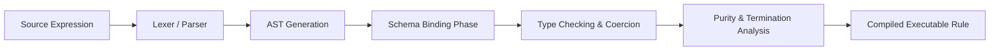
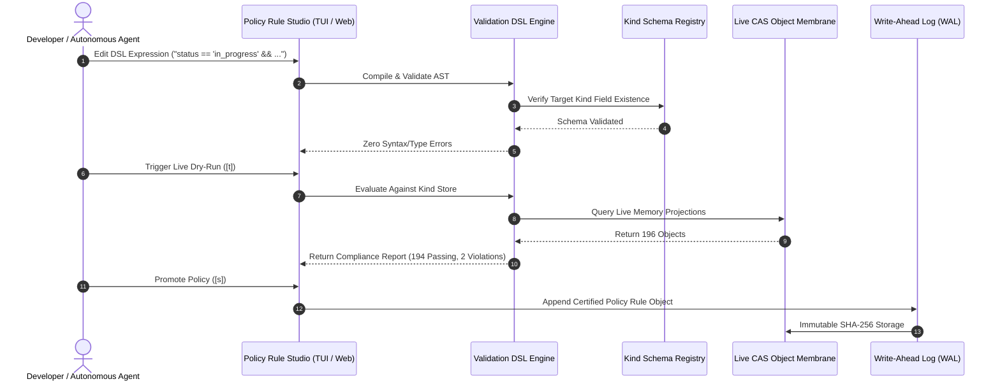

# Technical Specification: ZQK Declarative Validation & Policy Rule DSL Grammar

**Document ID:** `SPEC-VALIDATION-RULE-DSL-GRAMMAR`  
**Status:** Approved Architectural Specification  
**Version:** `1.0.0`  
**Author:** ZQK Architecture & Core Engineering Guild  
**Related Documents:**
- [`SPEC-ZPARQL-GRAPH-TRAVERSAL-GRAMMAR`](./SPEC-ZPARQL-GRAPH-TRAVERSAL-GRAMMAR.md)
- [`SPEC-ZQL-DECLARATIVE-MUTATION-GRAMMAR`](./SPEC-ZQL-DECLARATIVE-MUTATION-GRAMMAR.md)
- [`SPEC-ZQL-PREFLIGHT-VALIDATION`](./SPEC-ZQL-PREFLIGHT-VALIDATION.md)
- [`OBJECT_INSPECTOR_AND_POLICY_STUDIO`](../manual/OBJECT_INSPECTOR_AND_POLICY_STUDIO.md)

---

## 1. Executive Summary & Vision

The **ZQK Knowledge Kernel** models all project artifacts—goals, requirements, backlog items, test cases, acceptance criteria, policies, prompts, personas, and telemetry receipts—as strongly-typed, schema-backed entities stored in Content-Addressable Storage (CAS) and tracked in an append-only Write-Ahead Log (WAL).

While JSON Schema and YAML structural specs define the static shapes of these objects, real-world systems engineering demands **dynamic, contextual, and relational validation**:
- *“A backlog item cannot transition to `in_progress` without an explicit `claimed_by` assignee and an active `priority_plan_ref`.”*
- *“An item cannot be promoted to `complete` unless all bound acceptance criteria evaluate to `satisfied` and all linked test cases pass.”*
- *“Any object assigned priority tier `P0` must have a non-empty `effort_estimate` and an unbroken lineage trace to an approved `goal`.”*
- *“Before merging or deploying to production, security and performance gates must be verified or accompanied by an explicit signed waiver.”*

### 1.1 The Failure Modes of Existing Approaches
Historically, software architectures have attempted to address these requirements via two flawed paradigms:
1. **Hardcoded Imperative Logic (Go / Python)**: Writing procedural validation checks directly into application controllers couples business policies to binary releases, prevents hot-reloading, resists human-in-the-loop tuning, and is opaque to autonomous agent swarms.
2. **Turing-Complete Scripting (Lua / JavaScript)**: Embedding full-fledged interpreters creates severe security vulnerabilities, allows unbounded resource consumption (infinite loops), violates determinism, and complicates static preflight verification.

### 1.2 The Validation DSL Architectural Mandate
The **ZQK Validation & Policy Rule DSL** is a domain-specific, side-effect free, strongly-typed, and guaranteed-terminating predicate language. Inspired by the Common Expression Language (CEL) and declarative policy engines (Rego), it provides:
- **Mathematical Determinism**: Zero side effects, zero I/O access outside provided entity contexts, and constant-time or bounded linear-time evaluation ($O(N)$).
- **Fail-Closed Admission Control**: Rejects non-compliant mutations in memory during ZQL preflight before writing to CAS or the mutation WAL.
- **Interactive TUI Ergonomics**: First-class support for syntax highlighting, schema-aware field autocompletion, and real-time dry-run execution inside the **ZQK Policy Rule Studio** (`zqk object inspect --policy-studio`).

---

## 2. ISO/IEC 14977 Formal EBNF Grammar

The canonical formal grammar for the ZQK Validation DSL is defined below in standard ISO/IEC 14977 syntax:

```ebnf
(* ========================================================================== *)
(* ZQK Validation & Policy Rule DSL Formal Grammar (ISO/IEC 14977)             *)
(* ========================================================================== *)

rule_file
    = [ package_declaration ] , { import_declaration } , { rule_declaration } ;

package_declaration
    = "package" , identifier , { "." , identifier } , ";" ;

import_declaration
    = "import" , identifier , { "." , identifier } , ";" ;

rule_declaration
    = [ documentation_comment ] ,
      "rule" , rule_identifier ,
      "target" , kind_identifier ,
      [ "when" , expression ] ,
      "assert" , expression ,
      [ "severity" , severity_level ] ,
      [ "message" , string_literal ] ,
      ";" ;

rule_identifier
    = identifier ;

kind_identifier
    = identifier ;

severity_level
    = "CRITICAL" | "ERROR" | "WARNING" | "INFO" ;

(* --- Expression Hierarchy & Precedence (Lowest to Highest) --- *)

expression
    = implication_expr ;

(* Implication: p ==> q (equivalent to !p || q) *)
implication_expr
    = logical_or_expr , [ "==>" , implication_expr ] ;

(* Logical Disjunction: || *)
logical_or_expr
    = logical_and_expr , { "||" , logical_and_expr } ;

(* Logical Conjunction: && *)
logical_and_expr
    = equality_expr , { "&&" , equality_expr } ;

(* Equality & Regex Matching: ==, !=, =~, !~ *)
equality_expr
    = relational_expr , { equality_op , relational_expr } ;

equality_op
    = "==" | "!=" | "=~" | "!~" ;

(* Relational Comparisons: <, <=, >, >= *)
relational_expr
    = membership_expr , { relational_op , membership_expr } ;

relational_op
    = "<" | "<=" | ">" | ">=" ;

(* Membership & Set Inclusion: in, not in, contains *)
membership_expr
    = additive_expr , [ ( "in" | "not" , "in" | "contains" ) , additive_expr ] ;

(* Additive Arithmetic: +, - *)
additive_expr
    = multiplicative_expr , { ( "+" | "-" ) , multiplicative_expr } ;

(* Multiplicative Arithmetic: *, /, % *)
multiplicative_expr
    = unary_expr , { ( "*" | "/" | "%" ) , unary_expr } ;

(* Unary Operators: !, -, + *)
unary_expr
    = ( "!" | "-" | "+" ) , unary_expr
    | postfix_expr ;

(* Member Access, Indexing, and Function Invocations *)
postfix_expr
    = primary_expr , { member_access | index_access | function_invocation } ;

member_access
    = "." , identifier ;

index_access
    = "[" , expression , "]" ;

function_invocation
    = "(" , [ argument_list ] , ")" ;

argument_list
    = expression , { "," , expression } ;

(* Primary Expressions *)
primary_expr
    = literal
    | field_reference
    | quantifier_expr
    | paren_expr
    | list_literal
    | object_literal ;

paren_expr
    = "(" , expression , ")" ;

field_reference
    = identifier ;

(* --- High-Order Quantifiers (all, any, none, filter, map) --- *)
quantifier_expr
    = ( "all" | "any" | "none" | "filter" | "map" ) ,
      "(" , expression , "," , identifier , "->" , expression , ")" ;

(* --- Literals and Data Structures --- *)
list_literal
    = "[" , [ expression , { "," , expression } ] , "]" ;

object_literal
    = "{" , [ field_entry , { "," , field_entry } ] , "}" ;

field_entry
    = ( identifier | string_literal ) , ":" , expression ;

literal
    = string_literal
    | integer_literal
    | float_literal
    | boolean_literal
    | duration_literal
    | null_literal ;

string_literal
    = '"' , { character - ( '"' | "\" ) | escape_sequence } , '"'
    | "'" , { character - ( "'" | "\" ) | escape_sequence } , "'" ;

integer_literal
    = [ "-" ] , digit , { digit } ;

float_literal
    = [ "-" ] , digit , { digit } , "." , digit , { digit } ;

boolean_literal
    = "true" | "false" ;

duration_literal
    = integer_literal , ( "ns" | "us" | "ms" | "s" | "m" | "h" | "d" | "w" ) ;

null_literal
    = "null" ;

(* --- Lexical Tokens & Character Classes --- *)
identifier
    = ( letter | "_" ) , { letter | digit | "_" | "-" } ;

letter
    = "A" | "B" | "C" | "D" | "E" | "F" | "G" | "H" | "I" | "J"
    | "K" | "L" | "M" | "N" | "O" | "P" | "Q" | "R" | "S" | "T"
    | "U" | "V" | "W" | "X" | "Y" | "Z"
    | "a" | "b" | "c" | "d" | "e" | "f" | "g" | "h" | "i" | "j"
    | "k" | "l" | "m" | "n" | "o" | "p" | "q" | "r" | "s" | "t"
    | "u" | "v" | "w" | "x" | "y" | "z" ;

digit
    = "0" | "1" | "2" | "3" | "4" | "5" | "6" | "7" | "8" | "9" ;

escape_sequence
    = "\" , ( '"' | "'" | "\" | "/" | "b" | "f" | "n" | "r" | "t" ) ;

documentation_comment
    = "/**" , { character } , "*/"
    | "//" , { character - "\n" } , "\n" ;
```

---

## 3. Abstract Syntax Tree (AST) JSON Schema (Draft 2020-12)

The parser transforms validation expressions into a deterministic AST. The canonical JSON Schema contract is defined below:

```json
{
  "$schema": "https://json-schema.org/draft/2020-12/schema",
  "$id": "https://zqk.dev/schemas/ast/validation_rule_dsl_v1.json",
  "title": "ZQK Validation Rule DSL AST Schema",
  "type": "object",
  "required": ["version", "type", "rules"],
  "properties": {
    "version": { "type": "string", "const": "1.0.0" },
    "type": { "type": "string", "const": "ValidationRuleSet" },
    "package": { "type": "string" },
    "rules": {
      "type": "array",
      "items": { "$ref": "#/$defs/RuleDeclaration" }
    }
  },
  "$defs": {
    "RuleDeclaration": {
      "type": "object",
      "required": ["id", "target_kind", "assertion"],
      "properties": {
        "id": { "type": "string" },
        "target_kind": { "type": "string" },
        "when": { "$ref": "#/$defs/Expression" },
        "assertion": { "$ref": "#/$defs/Expression" },
        "severity": {
          "type": "string",
          "enum": ["CRITICAL", "ERROR", "WARNING", "INFO"],
          "default": "ERROR"
        },
        "message": { "type": "string" },
        "doc": { "type": "string" }
      }
    },
    "Expression": {
      "type": "object",
      "required": ["node_type"],
      "properties": {
        "node_type": {
          "type": "string",
          "enum": [
            "BinaryExpr",
            "UnaryExpr",
            "ImplicationExpr",
            "MemberAccessExpr",
            "IndexAccessExpr",
            "FunctionCallExpr",
            "QuantifierExpr",
            "LiteralExpr",
            "IdentifierExpr",
            "ListExpr",
            "ObjectExpr"
          ]
        },
        "pos": { "$ref": "#/$defs/SourcePosition" }
      },
      "allOf": [
        {
          "if": { "properties": { "node_type": { "const": "BinaryExpr" } } },
          "then": {
            "required": ["op", "left", "right"],
            "properties": {
              "op": { "type": "string", "enum": ["||", "&&", "==", "!=", "=~", "!~", "<", "<=", ">", ">=", "in", "not in", "contains", "+", "-", "*", "/", "%"] },
              "left": { "$ref": "#/$defs/Expression" },
              "right": { "$ref": "#/$defs/Expression" }
            }
          }
        },
        {
          "if": { "properties": { "node_type": { "const": "ImplicationExpr" } } },
          "then": {
            "required": ["antecedent", "consequent"],
            "properties": {
              "antecedent": { "$ref": "#/$defs/Expression" },
              "consequent": { "$ref": "#/$defs/Expression" }
            }
          }
        },
        {
          "if": { "properties": { "node_type": { "const": "UnaryExpr" } } },
          "then": {
            "required": ["op", "operand"],
            "properties": {
              "op": { "type": "string", "enum": ["!", "-", "+"] },
              "operand": { "$ref": "#/$defs/Expression" }
            }
          }
        },
        {
          "if": { "properties": { "node_type": { "const": "FunctionCallExpr" } } },
          "then": {
            "required": ["function_name", "arguments"],
            "properties": {
              "function_name": { "type": "string" },
              "arguments": {
                "type": "array",
                "items": { "$ref": "#/$defs/Expression" }
              }
            }
          }
        },
        {
          "if": { "properties": { "node_type": { "const": "QuantifierExpr" } } },
          "then": {
            "required": ["quantifier", "collection", "variable", "predicate"],
            "properties": {
              "quantifier": { "type": "string", "enum": ["all", "any", "none", "filter", "map"] },
              "collection": { "$ref": "#/$defs/Expression" },
              "variable": { "type": "string" },
              "predicate": { "$ref": "#/$defs/Expression" }
            }
          }
        },
        {
          "if": { "properties": { "node_type": { "const": "LiteralExpr" } } },
          "then": {
            "required": ["value_type", "raw_value"],
            "properties": {
              "value_type": { "type": "string", "enum": ["string", "int", "float", "bool", "duration", "null"] },
              "raw_value": {}
            }
          }
        },
        {
          "if": { "properties": { "node_type": { "const": "IdentifierExpr" } } },
          "then": {
            "required": ["name"],
            "properties": {
              "name": { "type": "string" }
            }
          }
        }
      ]
    },
    "SourcePosition": {
      "type": "object",
      "required": ["line", "column"],
      "properties": {
        "line": { "type": "integer", "minimum": 1 },
        "column": { "type": "integer", "minimum": 1 },
        "offset": { "type": "integer", "minimum": 0 }
      }
    }
  }
}
```

---

## 4. Static Typing & Semantic Validation Rules

The Validation DSL compiles into bytecode or direct Go AST evaluation nodes. During preflight compilation, the engine executes five static verification phases:



### 4.1 Type System & Value Domains

| Type Identifier | Description | Literal Representation / Example |
| :--- | :--- | :--- |
| `String` | UTF-8 encoded text sequences. | `"in_progress"`, `'backlog_item'` |
| `Int` | Signed 64-bit integers. | `0`, `42`, `-100` |
| `Float` | 64-bit IEEE 754 floating point numbers. | `3.14159`, `0.05` |
| `Bool` | Boolean truth values. | `true`, `false` |
| `Timestamp` | ISO 8601 UTC timestamp points in time. | `"2026-09-29T15:00:00Z"` |
| `Duration` | Relative time spans with units. | `500ms`, `15m`, `48h`, `7d` |
| `Ref` | Cryptographic or semantic object identifiers. | `"BLI-001"`, `"GOAL-STORAGE-01"` |
| `List<T>` | Homogeneous or heterogeneous array collections. | `["P0", "P1", "P2"]` |
| `Map<K, V>` | Key-value associative structures. | `{"tier": "P0", "weight": 1.5}` |
| `Null` | Absence of value or unset optional field. | `null` |

### 4.2 Schema Binding & Field Resolution
1. **Target Kind Confinement**: When a rule specifies `target backlog_item`, the identifier resolution table is populated exclusively with fields defined in `.zqk/specs/objects/backlog_item.yaml`.
2. **Missing Field Strictness**: Any reference to a field not registered in the schema (e.g. `non_existent_key == "foo"`) fails compilation immediately with `ERR_DSL_UNKNOWN_FIELD`.
3. **Null-Safety & Optional Navigation**:
   - Accessing subfields of an unset object returns `null` rather than throwing a panic.
   - Comparison with `null` is safe: `claimed_by != null` evaluates to `false` if `claimed_by` is absent or unset.
   - For string properties, checking `field != ""` guarantees both non-null and non-empty status.

### 4.3 Purity, Termination, and Complexity Bounds
- **No Unbounded Loops**: The grammar lacks general `for` and `while` loops. Iteration is restricted to bounded quantifiers (`all`, `any`, `filter`, `map`) operating over finite collections.
- **Maximum Execution Time**: Rule evaluation enforces an upper timeout limit of 50ms per entity. Exceeding this budget halts execution with `ERR_DSL_TIMEOUT_EXCEEDED`.
- **Zero I/O Guarantee**: All evaluation data must be present in the loaded entity memory map or pre-fetched relational index. Expressions cannot execute network, disk, or process calls directly.

---

## 5. Built-in Function & Predicate Standard Library

The Validation DSL standard library provides specialized predicates for kernel entities and VDS (Verifiable Decomposition Spine) done-gates:

### 5.1 Structural & String Predicates
- `len(val: String | List | Map) -> Int`: Returns the character count of a string or element count of a list/map.
- `contains(haystack: String | List<T>, needle: String | T) -> Bool`: Tests for substring containment or list membership.
- `matches(val: String, regex: String) -> Bool`: Compiles and executes a RE2 regular expression match against a string.
- `is_empty(val: Any) -> Bool`: Evaluates `true` if the target is `null`, an empty string `""`, or an empty list `[]`.

### 5.2 Chronological & Lifecycle Predicates
- `now() -> Timestamp`: Returns the current UTC system time.
- `age(ts: Timestamp) -> Duration`: Computes the duration elapsed between `ts` and current system time (`now() - ts`).
- `is_older_than(ts: Timestamp, d: Duration) -> Bool`: Returns `true` if `age(ts) > d`.

### 5.3 Knowledge Kernel & Graph Integrity Predicates
- `object_exists(id: Ref) -> Bool`: Queries the in-memory CAS live index to verify that the target object exists.
- `field_nonempty(field_name: String) -> Bool`: Asserts that `field_name` exists and is non-empty.
- `field_cleared(field_name: String) -> Bool`: Asserts that `field_name` is absent, null, or empty string.
- `any_nonempty(field_names: List<String>) -> Bool`: Asserts that at least one of the specified field names contains a non-empty value (supports comma- or colon-delimited field names in predicate strings, e.g. `any_nonempty:workstream_ref,milestone_ref` or `any_nonempty:workstream_ref:milestone_ref`), with automatic singular/plural fallback matching.
- `ref_valid(ref: Ref, expected_kind: String) -> Bool`: Confirms that the target object exists and matches the expected kind.

### 5.4 VDS Done-Gate Predicates
- `criteria_linked_or_acceptance_present() -> Bool`: Verifies that a work item has at least one linked acceptance criterion or explicit DoD clause.
- `tests_ok_per_customization() -> Bool`: Evaluates test execution status; returns `true` if all bound test cases pass.
- `git_diff_nonempty_or_waiver() -> Bool`: Ensures code changes exist on the active integration branch or an approved waiver is linked.
- `ci_required_checks_green_or_na() -> Bool`: Confirms CI status checks are passing.
- `security_gate_ok_or_na() -> Bool`: Asserts that vulnerability and secret scans have passed.
- `path_exists(relpath: String) -> Bool`: Confirms physical file existence within repository worktree.

---

## 6. Negative Invariants & Error Taxonomy

The compiler and evaluator emit deterministic, diagnostic-rich error codes adhering to the ZQK error receipt standard:

| Error Code | Trigger Condition | Diagnostic Context Emitted |
| :--- | :--- | :--- |
| `ERR_DSL_SYNTAX_ERROR` | Source string violates ISO/IEC 14977 grammar. | Line, column, token found, expected token set. |
| `ERR_DSL_UNKNOWN_FIELD` | Identifier does not exist in target kind schema. | Field name, target kind, available candidate fields (Levenshtein match). |
| `ERR_DSL_TYPE_MISMATCH` | Incompatible operator operands (e.g. `String + Int`). | Operator, left operand type, right operand type. |
| `ERR_DSL_UNDEFINED_FUNCTION` | Invocation of unknown standard library function. | Function name, candidate function suggestions. |
| `ERR_DSL_ARITY_MISMATCH` | Wrong number of arguments passed to function. | Function name, expected argument count, actual count. |
| `ERR_DSL_DIVISION_BY_ZERO` | Arithmetic division or modulus by numeric zero. | Expression offset, denominator sub-expression. |
| `ERR_DSL_TIMEOUT_EXCEEDED` | Evaluation duration exceeds 50ms budget. | Evaluation time, evaluated entity ID, rule identifier. |

---

## 7. Concrete Production Rule Specifications

Below are canonical examples of ZQK production validation rules across real kernel entity types:

### 7.1 Active Backlog Item Assignee Enforcement
```dsl
package zqk.governance.workstream;

/**
 * Enforces that any backlog item marked in_progress has an active claimed_by
 * identity and is bound to a valid priority plan.
 */
rule REQUIRE_CLAIMED_ON_IN_PROGRESS
target backlog_item
when
    status == "in_progress"
assert
    claimed_by != "" &&
    priority_plan_ref != "" &&
    object_exists(priority_plan_ref)
severity CRITICAL
message "Backlog items marked in_progress must specify an active claimed_by operator and valid priority_plan_ref.";
```

### 7.2 Definition of Done (DoD) Completion Gate
```dsl
package zqk.governance.dod;

/**
 * Forbids promoting any backlog item to complete unless all attached
 * criteria are satisfied and test cases have passing execution receipts.
 */
rule ENFORCE_DOD_CRITERIA_SATISFACTION
target backlog_item
when
    status == "complete"
assert
    len(criteria_refs) > 0 &&
    all(criteria_refs, c -> object_exists(c)) &&
    tests_ok_per_customization()
severity CRITICAL
message "Cannot complete backlog item without satisfied acceptance criteria and verified test suites.";
```

### 7.3 Priority Plan Scope & Tier Budget Validation
```dsl
package zqk.governance.pm;

/**
 * Guarantees that P0 and P1 priority plans carry effort estimates
 * and do not exceed standard sprint duration budgets.
 */
rule ENFORCE_P0_PLAN_ESTIMATION
target priority_plan
when
    priority_tier in ["P0", "P1"]
assert
    effort_estimate != "" &&
    target_completion_date != null &&
    target_completion_date > created_at
severity ERROR
message "High-priority plans (P0/P1) require explicit effort estimates and realistic target completion dates.";
```

### 7.4 Production Release Gate & Security Clearance
```dsl
package zqk.governance.release;

/**
 * Blocks deployment or promotion to production status if security gates
 * or preflight verification checks report open vulnerabilities.
 */
rule ENFORCE_RELEASE_GATE_ZERO_VULNERABILITIES
target release_milestone
when
    target_environment == "production"
assert
    security_gate_ok_or_na() &&
    ci_required_checks_green_or_na() &&
    publish_ack_present_if_public()
severity CRITICAL
message "Production release gates require 100% green security scans, passing CI pipelines, and public publication acknowledgments.";
```

---

## 8. Integration with Knowledge Kernel Architecture



### 8.1 Policy Rule Studio Integration (`ui_policy_studio.svg`)
The Validation DSL is the native execution substrate for the **ZQK Policy Rule Studio**:
- **Live Autocompletion**: When typing field names, the studio inspects the AST context and pulls candidate attributes directly from the schema registry.
- **Instantaneous Dry-Run**: Pressing `[t]` executes the in-memory compiled rule against all active objects of that kind in less than 15ms, displaying immediate compliance percentages and discrete violating IDs (`BLI-AUTH-004`, `BLI-UI-012`).
- **Fail-Closed Promotion**: Policies saved via `[s]` are committed into `.zqk/process/policy/` as immutable CAS records. Subsequent ZQL mutation attempts are automatically intercepted and governed by these rules.
