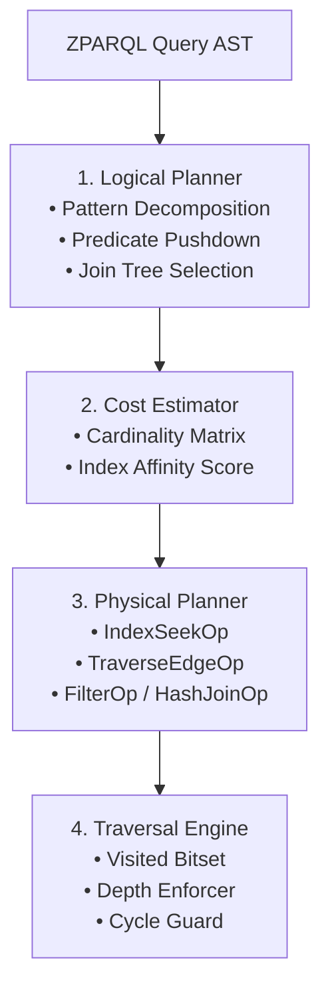

# Technical Specification: ZPARQL Query Planner Architecture & Complexity Proof

**Document ID:** `SPEC-ZPARQL-QUERY-PLANNER`  
**Status:** Approved Architectural Specification  

---

## 1. Executive Summary & Architecture

The **ZPARQL Query Planner and Traversal Engine** translates high-level graph pattern queries (defined in `SPEC-ZPARQL-GRAPH-TRAVERSAL-GRAMMAR`) into optimized physical execution plans that execute against the ZQK Knowledge Kernel.

Naive graph traversals traverse graphs using full-scan BFS or DFS loops:
$$\text{Cost}_{\text{naive}} = O(|V| + |E|)$$
In large enterprise kernels ($|V| > 10^5$, $|E| > 10^6$), full graph scans introduce intolerable latency and memory pressure. Furthermore, cyclic topologies (e.g. mutual dependencies, reciprocal review cycles, bidirectional links) trigger infinite recursion or stack overflows unless strictly bounded.

The ZPARQL Planner solves these challenges via:
1. **Logical Optimization**: AST analysis, Predicate Pushdown, Join Reordering, and Cardinality Estimation.
2. **Physical Optimization**: Index Seek Selection converting full scans ($O(N)$) into indexed pointer chases ($O(K)$) proportional only to matched subgraphs.
3. **Cycle-Safe Traversal**: Visited bitsets/tracking, strict maximum recursion depth limits ($D_{\max}$), and fail-closed cycle abortion.

---

## 2. Logical and Physical Execution Plan Contract

### 2.1 Planner Phases



### 2.2 Core Interfaces

```go
type QueryPlanner interface {
    // Plan compiles a declarative Pattern AST into an optimized PhysicalPlan.
    Plan(ctx context.Context, query *QueryAST) (*PhysicalPlan, error)
}

type TraversalEngine interface {
    // Execute runs a PhysicalPlan against the indexed graph storage.
    Execute(ctx context.Context, plan *PhysicalPlan) (*QueryResult, error)
}
```

### 2.3 Physical Operator Contract

1. **`IndexSeekOp`**: Directly looks up seed nodes matching exact primary keys or indexed properties:
   $$\text{Cost}(\text{IndexSeek}) = O(1) \text{ to } O(\log N)$$
2. **`TraverseIndexedEdgesOp`**: Follows outbound or inbound indexed edges of a given relation from current candidate nodes:
   $$\text{Cost}(\text{Traverse}) = O(\text{degree}(u)) = O(k)$$
3. **`PredicateFilterOp`**: In-memory evaluation of residual expressions (`WHERE` predicates).
4. **`HashJoinOp`**: Equi-join on shared variable bindings across disjoint path patterns.

---

## 3. Dynamic Behavior: $O(K)$ Subgraph Complexity Proof

### 3.1 Complexity Formulation

Let:
- $N = |V|$: Total vertices in the kernel graph.
- $M = |E|$: Total edges in the kernel graph.
- $K$: Number of nodes in the matched subgraph ($K \ll N$).
- $d_{\text{avg}}$: Average out-degree for indexed relation $R$.

When a query specifies starting anchors (e.g. `(b:backlog_item {id: 'BLI-001'})-[:criteria_refs]->(c:criteria)`), the planner selects an **Index Seek** on `b.id`, followed by edge index lookups on `criteria_refs`.

The total node and edge inspections performed by the engine is:
$$\text{Inspections}(Q) = 1 + \sum_{i=1}^K \text{degree}_R(v_i) \leq c \cdot K \ll N$$

Full graph scanning ($O(N)$) is strictly bypassed whenever an anchored node or indexed property filter is supplied.

---

## 4. Negative Invariant: Depth-Bounded Traversal & Cycle Detection

### 4.1 Traversal Guardrails

To prevent unbounded recursion and resource exhaustion on cyclic graphs:
1. **Configurable Max Depth ($D_{\max}$)**: Every traversal operator enforces a maximum traversal depth (default $D_{\max} = 16$, configurable). Exceeding this bound yields `ErrMaxDepthExceeded`.
2. **Visited Bitset / ID Set Tracking**: As paths expand, visited node identifiers are recorded along the current exploration path.
3. **Cycle Policies**:
   - `CyclePolicyFailClosed`: Immediately halts traversal with `ErrCyclicGraphDetected` upon encountering any back-edge or previously visited node along the active branch.
   - `CyclePolicyDeduplicate`: Safely prunes the cyclic edge without re-visiting or re-expanding already-evaluated subgraphs.

---

## 5. Verification Matrix

| Verification Target | Test Suite | Target Code Location | Invariant Verified |
| :--- | :--- | :--- | :--- |
| Query Plan Contract | `TestPlanner_ContractSpecification` | `pkg/semantic/graph/planner.go` | Planner compiles AST to physical plan with predicate pushdown and cost scoring. |
| Index Scan Complexity Proof | `TestPlanner_IndexScanComplexityProof` | `pkg/semantic/graph/planner.go` | $O(K)$ execution step count independent of background graph scale $N$. |
| Cyclic Traversal Negative | `TestPlanner_CyclicTraversalNegative` | `pkg/semantic/graph/planner.go` | Cycle detection triggers fail-closed error and depth limiter aborts unbounded recursion. |

---
