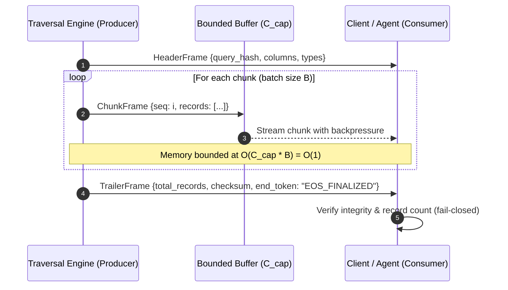

# Technical Specification: ZPARQL Portable Result Envelopes, Reactive Streaming, and Backpressure Protocol

**Document ID:** `SPEC-ZPARQL-RESULT-STREAMING`  
**Status:** Approved Architectural Specification  

---

## 1. Executive Summary & Purpose

When querying extensive graph topologies across multi-agent swarms, transmitting entire result sets as monolithic JSON arrays causes memory spikes, network congestion, and head-of-line blocking.

This specification formalizes:
1. **The Portable Result Envelope**: A self-describing framing format consisting of a schema header, chunked data frames, and an integrity trailer.
2. **Chunked Reactive Streaming with Backpressure**: Bounded-buffer streaming that delivers matched entities in fixed-size chunks under constant $O(1)$ memory overhead, automatically pausing upstream query traversal when downstream consumers lag.
3. **End-of-Stream (EOS) Integrity & Truncation Detection**: A fail-closed protocol verifying finalization tokens and record-count checksums to detect dropped packets, mid-stream disconnects, and partial buffer truncation.

---

## 2. Portable Result Envelope Specification

The result envelope is segmented into three sequential frames:



### 2.1 Header Frame
The initial frame describes query metadata, projection column definitions, and data types:
```json
{
  "frame_type": "header",
  "query_hash": "sha256:7f83b165...",
  "columns": ["id", "title", "priority_tier", "status"],
  "types": {
    "id": "string",
    "title": "string",
    "priority_tier": "string",
    "status": "string"
  }
}
```

### 2.2 Data Chunk Frames
Data frames carry fixed-size batches of matched entities (default chunk size: $B = 50$ or $100$ records):
```json
{
  "frame_type": "chunk",
  "sequence": 1,
  "records": [
    {"id": "BLI-101", "title": "Stream Engine", "priority_tier": "P1", "status": "planned"}
  ]
}
```

### 2.3 Trailer Frame (Integrity Token)
The final frame certifies clean end-of-stream delivery and contains cryptographic/hash verification:
```json
{
  "frame_type": "trailer",
  "total_records": 1000,
  "checksum": "sha256:c0535e4b...",
  "end_token": "EOS_FINALIZED"
}
```

---

## 3. Reactive Streaming & Backpressure Proof

### 3.1 Constant Memory Overhead $O(1)$
- **Producer Buffer**: Uses a bounded channel buffer $C_{\text{cap}}$ (e.g. 2 chunks).
- **Memory Consumption**: Memory usage is strictly bounded by:
  $$\text{Memory}_{\text{stream}} = O(C_{\text{cap}} \times B) = O(1)$$
  independent of total query result cardinality $N$.

### 3.2 Backpressure Propagation
When a downstream consumer processes records at rate $R_{\text{consumer}} < R_{\text{producer}}$, the bounded buffer fills. The producer channel send blocks, suspending graph traversal and CAS lookups until the consumer frees buffer capacity.

---

## 4. Truncation Detection & Fail-Closed Invariant

### 4.1 End-of-Stream Integrity Rule
A stream is considered valid **if and only if**:
1. All chunk frames from $1 \dots M$ are delivered contiguously without sequence gaps.
2. The stream terminates with a valid `trailer` frame containing `end_token == "EOS_FINALIZED"`.
3. The count of received records matches `trailer.total_records`.
4. The computed SHA-256 checksum of received record IDs matches `trailer.checksum`.

### 4.2 Negative Truncation Guard
- If a stream disconnects, closes prematurely, or omits the `EOS_FINALIZED` trailer, the consumer must fail closed and emit `ERR_ZPARQL_STREAM_TRUNCATED`.
- If record count or checksum does not match, the consumer must reject the partial result set and emit `ERR_ZPARQL_STREAM_CHECKSUM_MISMATCH`.
