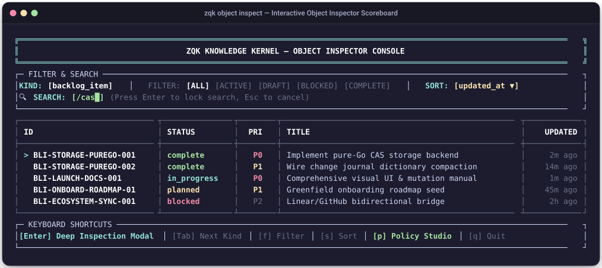
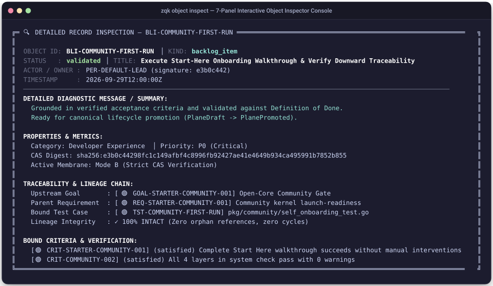
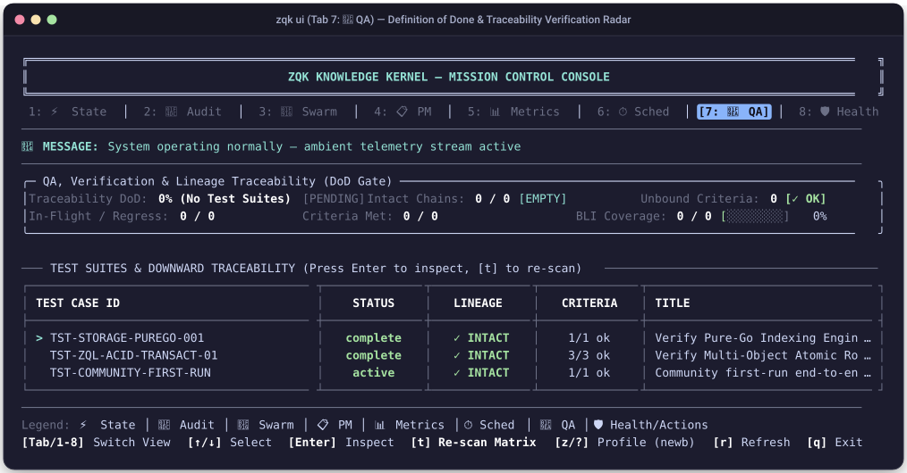
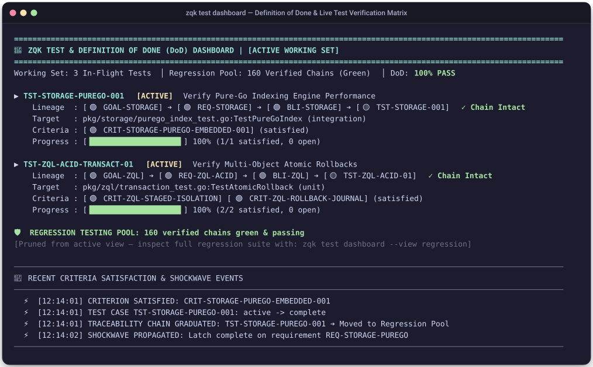

# Tutorial: Interactive Object Inspection, Mission Control & Visual Studio

In this hands-on tutorial, you will master the visual inspection, governance, and verification tools of the **Zen Quantum Kernel (ZQK)**. You will explore the terminal **Object Inspector (`zqk object inspect`)**, drill down into cryptographic CAS object lineage, author live governance rules with the **Policy Studio**, verify release readiness in **Mission Control (`zqk ui`)**, and visualize the entire knowledge graph in the **Visual Web Studio (`zqk ui -w`)**.

---

## Prerequisites

Ensure the ZQK binary is compiled and the kernel passes its baseline integrity checks:

```bash
go build -o ./bin/zqk ./cmd/zqk
./bin/zqk system check
```

---

## Step 1: Launch the Terminal Object Inspector

The **Object Inspector** is the primary terminal interface for exploring, filtering, and curating Knowledge Kernel objects. Launch it for any ontology kind (such as `backlog_item`):

```bash
./bin/zqk object inspect backlog_item
```

### Visual Overview: Main Object Inspector Table

The inspector displays an interactive Terminal Design System (TDS) table with live filtering, keyboard navigation, and property inspection:



### UI Element & Datapoint Overview:

| Visual Element / Datapoint | Visual Format | Semantic Meaning | Why It Is Useful & Operational Value |
| :--- | :--- | :--- | :--- |
| **Console Banner** | Boxed ASCII Header | Identifies the active ZQK Knowledge Kernel console session. | Confirms terminal connection to the local cellular repository and Content-Addressable Storage (CAS). |
| **Kind Selector Pill** | `KIND: [backlog_item]` | Active ontology kind being queried. | Use `[Tab]` or `[Shift+Tab]` to cycle through all 12 registered kinds (`backlog_item`, `requirement`, `goal`, `test_case`, `criteria`, `policy`, etc.). |
| **Filter Pills** | `FILTER: [ALL] [ACTIVE]...` | Active row lifecycle filtering mode. | Press `[f]` to toggle between `[ALL]`, `[ACTIVE]` (in_progress/testing), `[DRAFT]` (originated), `[BLOCKED]`, `[COMPLETE]`, and `[MINE]`. |
| **Sort Indicator** | `SORT: [updated_at ▼]` | Active attribute and direction used for row sorting. | Press `[s]` to cycle sort criteria: `updated_at`, `created_at`, `priority`, `status`, `id`, and `title`. |
| **Search Buffer** | `🔍 SEARCH: [/<query>█]` | Dynamic substring filter buffer. | Press `[/]` to search titles and IDs in real time; press `[Enter]` to lock or `[Esc]` to clear. |
| **Object ID Column** | `BLI-STORAGE-PUREGO-001` | Unique content-addressable identifier with kind prefix. | Guaranteed stable reference across all branch operations, workstreams, and git history. |
| **Status Badge** | `complete`, `in_progress` | Current state within the kind's authoritative Finite State Machine (FSM). | Color-coded status indicator: green for `complete`, cyan for `in_progress`, yellow for `planned`, red for `blocked`. |
| **Priority Badge** | `P0`, `P1`, `P2`, `P3` | Relative scheduling weight within the active Priority Plan. | Guides autonomous agents (`whats-next`) and human operators to high-leverage blockers first. |
| **Selection Cursor** | `> ` (Cyan highlight) | Currently highlighted row. | Use `[j]`/`[k]` or arrow keys to navigate; press `[Enter]` to open the Deep Inspection Modal. |
| **Hotkey Footer** | Single-line shortcut bar | Actionable keyboard controls for current screen mode. | Eliminates guesswork by displaying contextual commands (`[Enter]`, `[Tab]`, `[f]`, `[s]`, `[p]`, `[q]`). |

---

## Step 2: Deep Object Inspection Modal

Select a row using `[j]`/`[k]` and press `[Enter]`. The Object Inspector opens the **Deep Object Inspection Modal**:

### Visual Overview: Deep Object Inspector Modal



### UI Element & Datapoint Overview:

The modal decomposes raw YAML into three standardized visual modules:

| Visual Module / Datapoint | Value Example | Semantic Meaning & Diagnostic Purpose |
| :--- | :--- | :--- |
| **Object Header Card** | `[BLI-STORAGE-PUREGO-001]` | Displays the entity's Title, Kind, Status (`complete`), Priority (`P0`), and Claimed Actor (`ACC-SYSTEM`). Confirms entity ownership and lifecycle phase. |
| **Module 1: Lineage Radar** | `Goal: [GOAL-STORAGE]` | **Root Goal**: Traces the entity upstream to its overarching business or architectural objective. |
| | `Requirement: [REQ-STORAGE-001]` | **Upstream Requirement**: Documents the functional specification that mandates this backlog item. |
| | `Test Case: [TST-STORAGE-001]` | **Downstream Test**: References the automated test code that objectively verifies the implementation. |
| | `Criteria: [CRIT-STORAGE-001]` | **Acceptance Criteria**: Identifies the formal done-gate latch that must evaluate to green. |
| | `Integrity: [✓ CHAIN INTACT]` | **Lineage Health**: Confirms 100% unbroken lineage from root goal down to test criteria. No orphaned items allowed. |
| **Module 2: CAS Storage Hygiene** | `Plane: PlanePromoted` | **Storage Plane**: Distinguishes between untrusted agent drafts (`PlaneDraft`) and authoritative master records (`PlanePromoted`). |
| | `Hash: e3b0c442...` | **SHA-256 Digest**: Immutable content-addressed hash of the serialized object YAML. Tamper-evident and verifiable. |
| | `Path: .zqk/process/...` | **Disk Path**: Absolute repository-relative location of the underlying object file. |
| | `Size: 1,420 bytes` | **Storage Footprint**: Physical byte size on disk. Alerts operators to bloating or unnecessary metadata. |
| | `Permissions: 0644` | **POSIX Mode**: Strict file permission enforcement preventing unauthorized world-writable modifications. |
| | `ETag: rev_84920` | **Optimistic Concurrency ETag**: Prevents lost-update hazards during concurrent swarm mutations. |
| | `Last Mutation: 2026-09-29` | **Provenance Timestamp**: Records the exact UTC timestamp and actor identifier responsible for the latest change. |
| **Module 3: Action Palette** | `[p] Promote Status` | Advances entity to the next lifecycle state (evaluating FSM check-valves and criteria latches). |
| | `[d] Demote Status` | Reverts entity to previous state with safety checks. |
| | `[r] Add Reference` | Opens relationship linker to safely connect new upstream or downstream edges. |
| | `[x] Remove Ref` | Prunes graph edges without syntax errors or manual YAML slicing. |
| | `[e] Edit ($EDITOR)` | Launches `$EDITOR` for scalar attribute modifications (`title`, `description`). |

Press `[Esc]` to close the modal.

---

## Step 3: Author and Evaluate Rules in Policy Rule Studio

Press `[p]` while in the Object Inspector to enter the **Live Policy Rule Studio**. This studio lets you write governance rules in the ZQK Policy DSL and evaluate them across the entire kernel in real time:


### UI Element & Datapoint Overview:

| Visual Element / Datapoint | Semantic Meaning | Why It Is Useful & Operational Value |
| :--- | :--- | :--- |
| **Target Kind Header** | `TARGET KIND: [backlog_item]` | Specifies which ontology schema is being targeted by the active rule set. |
| **DSL Expression Input** | `status == "in_progress" && ...` | Live boolean predicate written in ZQK's type-safe expression syntax. Evaluated against all instances of the kind. |
| **Schema Autocomplete Bar** | `AUTOCOMPLETE: [claimed_by]...` | Schema-aware attribute hints populated directly from `.zqk/specs/objects/`. Press `[Tab]` to insert. |
| **Compliance Counter** | `✓ 194 / 196 objects COMPLIANT` | Instant quantitative score showing repository adherence to the rule before enforcement. |
| **Violation Breakdown** | `✗ 2 objects VIOLATE RULE` | Pinpoints violating object IDs and displays the exact reason for non-compliance. Enables targeted remediation. |

Press `[Esc]` to exit Policy Studio.

---

## Step 4: Mission Control Console & Definition of Done Verification

To verify that your work meets the repository's strict quality standards, launch **Mission Control** directly into the QA tab:

```bash
./bin/zqk ui --tab qa
```

### Visual Overview: Mission Control QA Tab



### UI Element & Datapoint Overview:

| Visual Element / Datapoint | Visual Format | Semantic Meaning & Operational Purpose |
| :--- | :--- | :--- |
| **Header Tab Strip** | `[1: ⚡ State] ... [7: 🧪 QA]` | Tab selector. Use number keys `[1]`–`[8]` or `[Tab]` to switch between telemetry planes. Reverse video indicates Tab 7 is active. |
| **Ambient Message Line** | `🔔 MESSAGE: QA test matrix...` | Real-time status banner reporting live kernel events, test runs, and background daemon cycles. |
| **Test Suites Table** | `Suite: hygiene, tree_police...` | Formats registered Go and verification test suites. Displays test counts, pass/fail status, and sub-second runtimes. |
| **Execution Metrics** | `Total: 14 │ Passed: 14 │ Failed: 0` | Immediate aggregate test health. Zero test failures tolerated for PR merges. |
| **Criteria Done-Gate Table** | `CRIT-* │ SATISFIED │ PASS` | Authoritative acceptance criteria latches. Shows each criterion's verification method (`automated_test` vs `manual_check`) and cryptographic latch state. |
| **DoD Verification Card** | `DoD Status: SATISFIED` | Kernel-computed **Definition of Done** gate. Confirms all test cases have unbroken lineage up to goals and zero unbound criteria remain. |
| **Release Verdict Pill** | `[✓ APPROVED FOR SHIP]` | Authoritative green release light. When green, the pull request may be merged and binaries promoted. |

Press `[q]` to exit Mission Control.

---

## Step 5: Test Verification Dashboard

For deep continuous integration and automated test-matrix auditing, run the dedicated **Test Verification Dashboard**:

```bash
./bin/zqk test dashboard --check-dod
```

### Visual Overview: Test Verification Dashboard



### UI Element & Datapoint Overview:

| Visual Element / Datapoint | Visual Format | Semantic Meaning & Diagnostic Value |
| :--- | :--- | :--- |
| **Overall Pass Percentage** | `100.0% PASS (179/179)` | High-level summary of test suite execution across the entire codebase. |
| **Lineage Linearity Metric** | `100% Lineage Integrity` | Verifies that every single test case points to a valid `criteria_ref`, which points to a `backlog_item_ref`, which points to a `requirement_ref`, which points to a `goal_ref`. |
| **Orphan & Unbound Scanner** | `0 Unbound Test Criteria` | Confirms no criteria exist in limbo without automated test coverage or verified manual checklists. |
| **Failure Triage Box** | `Clean (0 Failures)` | If any test fails, this card expands to display the failure stack trace, package path, and linked backlog item. |

---

## Step 6: Visual Web Studio (Timeline & Gantt Roadmap & DAG Visualizer)

For graphical topologies and interactive roadmap navigation, launch the **Visual Web Studio**:

```bash
./bin/zqk ui -w
```

Web Studio provides two specialized views accessible via browser tabs:
1. **Timeline & Gantt Roadmap**: `http://127.0.0.1:8080/studio/gantt`
2. **Ontology DAG Visualizer**: `http://127.0.0.1:8080/studio/dag-visualizer`

### Part 1: Chronological Timeline & Gantt Roadmap (`/studio/gantt`)


### UI Element & Datapoint Overview (Gantt View):

| Visual Component | Visual Location | Semantic Meaning & Operator Value |
| :--- | :--- | :--- |
| **Status Filter Pills** | Sub-Toolbar (Left) | Interactive buttons (`All`, `In Progress`, `Planned`, `Completed`) filtering visible roadmap items by lifecycle status. |
| **Grouping Selector** | Sub-Toolbar (Center) | Reorganizes timeline rows into swimlanes by `Workstream`, `Priority Plan`, or `Milestone`. |
| **Interactive Legend Bar** | Top Bar | Semantic legend: `◆ Milestone` (Orange), `🌐 Workstream` (Blue), `▶ In Progress` (Blue), `⏳ Planned` (Gray), `✓ Completed` (Green), `| Today Line` (Red). |
| **Calendar Axis & Day Ticks** | Header Grid (Top) | Seven-day continuous calendar axis (`Sep 26` to `Oct 02`) with proportional day columns. |
| **Vertical "Today" Line** | Full Height Line | High-contrast red dashed vertical line (`#f85149`) anchoring current execution time against scheduled tasks. |
| **Swimlane Section Headers** | Canvas Bands | Dark container bars grouping related backlog items under top-level workstream themes (`WS-CORE-LAUNCH`, `WS-STORAGE`). |
| **Milestone Diamond Markers** | Timeline Grid | Diamond markers (`◆`) indicating critical release gates and achievement status (`✓ Achieved`). |
| **Horizontal Gantt Bars** | Timeline Grid | Proportional progress bars displaying duration, state, and percentage complete (e.g. `▶ 75% complete`). |
| **Gantt Inspector Drawer** | Right Sidebar (372px) | Expandable detail drawer displaying selected entity properties, scheduled dates, parent milestones, and downward backlog chains. |

---

### Part 2: Ontology & Causal Dependency DAG Visualizer (`/studio/dag-visualizer`)


### UI Element & Datapoint Overview (DAG Visualizer):

| Visual Component | Visual Location | Semantic Meaning & Operator Value |
| :--- | :--- | :--- |
| **Browser Chrome & URL Bar** | Top Frame | Displays local host connection (`http://127.0.0.1:8080/studio/dag-visualizer`) and dark-mode styling (`#0d1117`). |
| **View Switcher Tabs** | Header Center | Switches between views: `☊ DAG Graph` and `▤ Timeline & Gantt`. |
| **Status Connection Pill** | Header Right | Live status indicator (`🟢 Connected`) confirming real-time SSE stream with Knowledge Kernel. |
| **DAG Canvas Toolbar** | Sub-header | Layout controls (`+`, `−`, `⟲`, `⛶`), Subgraph focus banner, and node kind filter chips (`All`, `WS`, `Goals`, `Plans`, `BLIs`). |
| **Node Kind Color Badges** | DAG Canvas | Color-coded nodes matching ZQK's authoritative ontology palette: |
| | • `WORKSTREAM` (Teal `#39c5bb`) | Top-level architectural themes and program boundaries. |
| | • `GOAL` (Purple `#a371f7`) | Strategic product/engineering goals. |
| | • `PRIORITY PLAN` (Blue `#58a6ff`) | Groomed, shovel-ready milestones scheduled for execution. |
| | • `BACKLOG ITEM` (Green `#3fb950`) | Discrete work units claimed and executed by agents. |
| | • `TEST CASE` (Pink `#db61a2`) | Automated test code suites. |
| | • `CRITERIA` (Emerald `#3fb950`) | Verification latches and Definition of Done done-gates. |
| **Directed Bezier Splines** | DAG Canvas | Smooth cubic Bezier curves (`M... C...`) with directional arrowheads showing upstream-to-downstream causal flow. |
| **Object Inspector Drawer** | Right Sidebar (372px) | Expandable drawer showing deep attributes for the currently clicked node: CAS SHA-256 digest, properties table, lineage radar, and action buttons (`Promote Object`, `Add Reference`, `Raw CAS JSON`). |

---

## Summary & Command Quick-Reference

You now have a complete, hands-on command of ZQK's visual inspection and governance tools:

| Task | Canonical Command / Hotkey | Description |
| :--- | :--- | :--- |
| **Object Inspector** | `./bin/zqk object inspect [kind]` | Open interactive TDS table for any kind. |
| **Deep Inspection Modal** | `[Enter]` on any row | Inspect lineage radar, CAS hash, file path, and action palette. |
| **Policy Rule Studio** | `[p]` in Object Inspector | Author and dry-run evaluate live governance DSL rules. |
| **Mission Control Console** | `./bin/zqk ui` | Full 8-tab terminal operations dashboard. |
| **QA Done-Gates Tab** | `./bin/zqk ui --tab qa` | Verify Definition of Done, test suites, and criteria latches. |
| **Test Verification Dashboard**| `./bin/zqk test dashboard --check-dod` | Automated CI test matrix and lineage verification. |
| **Visual Web Studio** | `./bin/zqk ui -w` | Modern browser-based DAG visualizer, Gantt timeline, and drawer inspector. |
