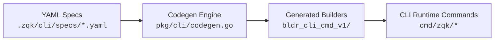

# CLI Architecture & Spec Command Builders

This package provides the command-line interface infrastructure for zqk, following the spec-driven builder pattern established in `pkg/specbuilder`.

## Architecture Overview



### Directory Structure

```
pkg/cli/
├── command_spec.go              # Command spec definitions (like objects.Spec)
├── command_spec_builder.go      # Builder for creating commands from specs
├── codegen.go                   # Codegen for command builders (like pkg/specbuilder/builders/codegen.go)
├── codegen_test.go
├── bldr_cli_cmd_v1/             # Generated command builders (like pkg/specbuilder/bldr_trait_v1/)
│   ├── get_command_builder.go
│   ├── create_command_builder.go
│   ├── list_command_builder.go
│   └── ...
└── testdata/
    └── *.yaml                   # Command spec examples
```

## Relationship to pkg/specbuilder

The command builder system mirrors the specbuilder pattern:

| Aspect | pkg/specbuilder | pkg/cli |
|--------|----------------|---------|
| **Specs** | `objects.Spec` (YAML) | `CommandSpec` (YAML) |
| **Codegen** | `pkg/specbuilder/builders/codegen.go` | `pkg/cli/codegen.go` |
| **Generated Builders** | `pkg/specbuilder/bldr_v2/` | `pkg/cli/bldr_cli_cmd_v1/` |
| **Versioning** | `bldr_v2`, `bldr_trait_v1`, etc. | `bldr_cli_cmd_v1` |
| **System Command** | `zqk system generate-builders` | `zqk system generate-command-builders` |
| **Output Type** | `*objects.Spec` | `*cobra.Command` |

### Key Differences

1. **Domain**: Specbuilders create object specs (system configuration), command builders create CLI commands (user interface)
2. **Output**: Specbuilders output `*objects.Spec`, command builders output `*cobra.Command`
3. **Base Classes**: Specbuilders use `BaseSpecBuilder`, command builders use `CommandBuilder`/`CRUDCommandBuilder`
4. **Integration**: Command builders integrate with Cobra framework, specbuilders integrate with object system

### Similarities

1. **Pattern**: Both follow spec → codegen → generated builder pattern
2. **Versioning**: Both use versioned directories (`bldr_*_v1`, `bldr_*_v2`)
3. **Codegen**: Both use similar codegen approaches (read YAML, generate Go code)
4. **Source of Truth**: Both use YAML specs as the single source of truth
5. **Graph Integration**: Both can be integrated into the graph for GraphRAG

## Command Spec Structure

Command specs are defined in `.zqk/cli/specs/` and follow this structure:

```yaml
name: "get <id>"
short: "Get an object by ID"
description: |
  Get an object by its ID.
  
  The object kind is inferred from the ID format.

args:
  type: "exact"
  count: 1

help:
  examples:
    - comment: "Get a backlog item"
      command: "%s get BLI-001"

run_e: "runGet"
common_flags: true

# Trait requirements (connects to pkg/objects/trait_registry.go)
required_traits:
  - readable
```

## Generated Builders

Generated builders in `bldr_cli_cmd_v1/` are created from command specs using codegen:

```go
// Generated from command spec - DO NOT EDIT MANUALLY
func NewGetCommandBuilder() *cobra.Command {
    return clipkg.NewCommandBuilder("get <id>").
        WithShort("Get an object by ID").
        WithHelpBuilder(/* ... */).
        WithArgs(cobra.ExactArgs(1)).
        WithCommonFlagsDefault(cli.AddCommonFlags).
        Build()
}
```

## Usage in Commands

Commands use generated builders and add their `RunE` implementation:

```go
func NewGetCmd() *cobra.Command {
    cmd := bldr_cli_cmd_v1.NewGetCommandBuilder()
    cmd.RunE = runGet  // Add actual implementation
    return cmd
}
```

When reading multi-value flags in `RunE`, match the spec YAML type to the pflag getter (e.g. `string_array` → `GetStringArray`, `stringSlice` → `GetStringSlice`). See **`bldr_cli_cmd_v1/README.md`** — *RunE handlers and pflag getters*.

## Trait Integration

Command specs can specify trait requirements that connect to the object trait system:

- `required_traits`: Traits always required (e.g., `listable` for `list` command)
- `conditional_traits`: Traits required when flags are used (e.g., `groupable` when `--group-by` is set)
- `required_trait_groups`: Trait groups required (e.g., `base_object_traits`)

This enables:
- Early validation before command execution
- Better error messages
- Graph relationships: Commands → Traits → Objects
- GraphRAG queries for semantic discovery

## Graph Integration

Command specs can be stored in the graph with relationships:

- `OPERATES_ON`: Command → Object Kind
- `REQUIRES_TRAIT`: Command → Trait
- `HAS_SUBCOMMAND`: Command → Subcommand
- `PERFORMS_OPERATION`: Command → Operation Type

This enables GraphRAG queries like:
- "What commands require the listable trait?"
- "What traits does the list command require?"
- "What commands operate on backlog_item objects?"
