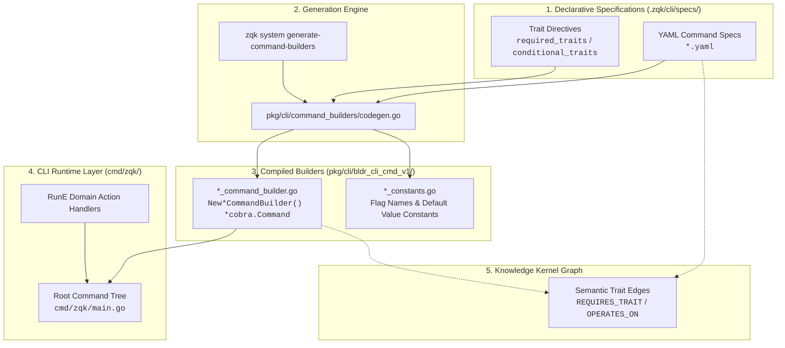

# CLI Command Builders (`bldr_cli_cmd_v1`)

> **Subsystem:** Kernel Subsystems — Spec & Command Builders  
> **Go Package:** `github.com/zqk-os/zqk/pkg/cli/bldr_cli_cmd_v1`  
> **Source Specs:** `.zqk/cli/specs/*.yaml`  
> **Generation Engine:** `pkg/cli/command_builders/codegen.go`  
> **Output Type:** `*cobra.Command`  
> **Status:** Active / Code-Generated  

---

> [!IMPORTANT]
> **Fail-Closed Code Generation Discipline**  
> All Go source files in this directory (`*_command_builder.go`, `*_constants.go`) are automatically generated by the ZQK Spec-Driven Builder engine. **Never edit files in this package manually.**  
> Any changes to command flags, descriptions, examples, aliases, or traits must be authored directly in the corresponding YAML specification under `.zqk/cli/specs/`, and regenerated using:
> ```bash
> ./bin/zqk system generate-command-builders --overwrite
> ```

---

## 1. Executive Overview

The `bldr_cli_cmd_v1` package contains the concrete, versioned Go command builders that assemble the ZQK CLI interface tree. Rather than manually wiring boilerplate `cobra.Command` structs, flags, and help strings across hundreds of individual command implementations, ZQK enforces a **declarative, schema-first CLI architecture**:

1. **Declarative Interface Definition**: Command metadata, argument arity, flags, enums, defaults, and usage examples are defined in structured YAML specifications.
2. **Immutable Versioning**: Builders reside in version-scoped directories (`bldr_cli_cmd_v1`). Breaking changes to builder generation or interface contracts increment to `bldr_cli_cmd_v2`, preserving backwards compatibility and audit trails.
3. **Decoupled Handlers**: Command builders construct the syntactic and presentation layer (`*cobra.Command`), leaving business logic and execution handlers (`RunE`) to domain controllers in `cmd/zqk/`.
4. **Ontological Graph Binding**: CLI command specs declare semantic traits (`required_traits`, `conditional_traits`), binding CLI operations directly into the Knowledge Kernel's entity-relationship graph.

---

## 2. Architecture & Codegen Pipeline

The generation pipeline transforms static YAML command specifications into compiled, type-safe Cobra builders integrated with the ZQK Terminal Design System (TDS) and runtime argument parsers:



---

## 3. Dual Builder Systems: Command Builders vs. Object Specbuilders

ZQK operates two parallel spec-driven builder architectures: **Object Specbuilders** (`pkg/specbuilder/bldr_v2`) and **CLI Command Builders** (`pkg/cli/bldr_cli_cmd_v1`):

| Architectural Dimension | Object Specbuilders (`pkg/specbuilder/bldr_v2`) | CLI Command Builders (`pkg/cli/bldr_cli_cmd_v1`) |
| :--- | :--- | :--- |
| **System Domain** | Kernel Data Models & Entity Configurations | CLI Presentation & Command Interface |
| **Source Specifications** | `objects.Spec` YAML (`.zqk/specs/objects/`) | `CommandSpec` YAML (`.zqk/cli/specs/`) |
| **Codegen Engine** | `pkg/specbuilder/builders/codegen.go` | `pkg/cli/command_builders/codegen.go` |
| **Generated Output** | `*objects.Spec` | `*cobra.Command` |
| **Base Class** | `BaseSpecBuilder` | `clipkg.CommandBuilder` / `CRUDCommandBuilder` |
| **Target Consumer** | Knowledge Kernel Engine (`pkg/storage`, `pkg/graph`) | CLI Framework (`cmd/zqk/*`, `spf13/cobra`) |
| **System Regeneration** | `./bin/zqk system generate-builders` | `./bin/zqk system generate-command-builders` |

---

## 4. Multi-Value Flag Parsing Invariant (`string_array` vs. `stringSlice`)

> [!CAUTION]
> **Silent Flag Failure Vector**  
> In Cobra and `pflag`, `StringArray` and `StringSlice` are fundamentally incompatible flag types with divergent parsing behaviors:
> - **`string_array`** (`pflag.StringArray`): Expects repeated flags for multiple values (`--filter "a=1" --filter "b=2"`).  
>   **Must be read with:** `cmd.Flags().GetStringArray("flag-name")`.
> - **`stringSlice`** (`pflag.StringSlice`): Expects comma-separated flag arguments (`--columns id,name,status`).  
>   **Must be read with:** `cmd.Flags().GetStringSlice("flag-name")`.
>
> If a `RunE` handler invokes `GetStringSlice` on a flag generated as `string_array` (or vice versa), `pflag` encounters a type assertion failure and **silently returns an empty slice `[]string{}`** without logging or raising an error. Always verify the YAML flag declaration type before implementing the handler.

### Flag Configuration Matrix

| YAML `type` | `pflag` Internal Kind | User Invocation Syntax | Handler Getter Method | Common Use Cases |
| :--- | :--- | :--- | :--- | :--- |
| `string_array` | `StringArray` | `--flag val1 --flag val2` | `cmd.Flags().GetStringArray("flag")` | Filters, predicate conditions, repeated query tags |
| `stringSlice` | `StringSlice` | `--flag val1,val2,val3` | `cmd.Flags().GetStringSlice("flag")` | Output columns, sort fields, CSV parameters |
| `string` | `String` | `--flag value` | `cmd.Flags().GetString("flag")` | Identifiers, references, file paths, formats |
| `bool` | `Bool` | `--flag`, `--flag=true` | `cmd.Flags().GetBool("flag")` | Toggles, force switches, dry-run flags |
| `duration` | `Duration` | `--flag 5m`, `--flag 30s` | `cmd.Flags().GetDuration("flag")` | Timeouts, poll cadences, lock TTLs |
| `int` | `Int` | `--flag 10` | `cmd.Flags().GetInt("flag")` | Limits, counts, retry limits, port numbers |

---

## 5. Anatomy of a Generated Command Builder

Every generated builder exposes an idiomatic constructor function `New{Command}CommandBuilder() *cobra.Command`. Below is a representative deconstruction:

```go
// Code generated by zqk system generate-command-builders. DO NOT EDIT.
package bldr_cli_cmd_v1

import (
    "github.com/spf13/cobra"
    "github.com/zqk-os/zqk/pkg/cliapp"
    clipkg "github.com/zqk-os/zqk/pkg/cli"
)

// NewAgentClaimCommandBuilder creates the agent_claim command builder
func NewAgentClaimCommandBuilder() *cobra.Command {
    // 1. Initialize command signature and summary
    builder := clipkg.NewCommandBuilder("claim <task_id>")
    builder.WithShort("Atomically claim an agent_task for exclusive execution")

    // 2. Configure TDS Dynamic Help with formatted descriptions and examples
    help := clipkg.DynamicHelpBuilder("Atomically claim an agent_task for exclusive execution")
    help.WithDescriptionLines(
        "Sets claimed_by and claimed_at so only one seat executes the task. Fails if",
        "another agent already holds the claim. Hourglass deadline wake is opt-in.",
    )
    help.AddExample("Claim a task as this seat", "%s agent claim <task-id> --by <seat-id>")
    help.AddExample("Claim work for a backlog item", "%s agent claim <task-id> --for <backlog-id> --by <seat-id>")
    help.ExcludeFlag("columns")
    builder.WithHelpBuilder(help)

    // 3. Enforce strict argument arity rules
    builder.WithArgs(cobra.ExactArgs(1))

    // 4. Attach typed flag definitions discovered from the YAML spec
    builder.AddStringFlag("by", "", "", "Claimant agent or account id (default: seating or env identity)")
    builder.AddDurationFlag("checkin-cadence", "", "5m0s", "How long the claim may stay silent before the orchestrator is woken")
    builder.AddStringFlag("cvs", "", "", "Active convergence session reference")
    builder.AddBoolFlag("exit-when-cvs-completed", "", false, "Block exit until the referenced convergence session is complete")
    builder.AddStringFlag("for", "", "", "Target backlog item or related object reference")
    builder.AddBoolFlag("hourglass-on", "", false, "Enable hourglass deadline wake signal")

    // 5. Inherit shared global/common flags while respecting exclusions
    builder.WithCommonFlagsExcluding(cli.AddCommonFlagsExcluding, []string{"columns"})

    // 6. Compile into a standard *cobra.Command instance
    cmd := builder.Build()
    return cmd
}
```

---

## 6. Trait Integration & Knowledge Kernel Graph

Command specs participate in the kernel's ontological graph. In YAML command specifications, commands declare behavioral trait dependencies:

```yaml
# .zqk/cli/specs/list_command.yaml
name: "list <kind>"
short: "List objects of a specified kind"
required_traits:
  - listable  # References trait from .zqk/specs/traits/listable.yaml
conditional_traits:
  - flag: "group-by"
    traits: ["groupable"]
  - flag: "sort-by"
    traits: ["sortable"]
```

### Semantic Graph Edges
When ingested into the Knowledge Kernel graph:
- **`REQUIRES_TRAIT` Edges**: Link the CLI command entity to necessary trait specifications, verifying at runtime whether the targeted object kind implements the required interfaces.
- **`OPERATES_ON` Edges**: Connect commands to the ontological object kinds they mutate or query.
- **GraphRAG Discovery**: AI agents and autonomous reasoning loops query these graph connections via ZPARQL to dynamically discover commands capable of fulfilling higher-level goals.

---

## 7. Developer Workflow & Regeneration Runbook

### Adding or Updating a CLI Command

1. **Author the Specification**: Create or modify the YAML spec file in `.zqk/cli/specs/<command>.yaml`.
   ```bash
   $EDITOR .zqk/cli/specs/object_inspect.yaml
   ```
2. **Execute Builder Regeneration**:
   ```bash
   ./bin/zqk system generate-command-builders --overwrite
   ```
3. **Verify Generated Files**:
   Inspect the newly created or updated builder in `pkg/cli/bldr_cli_cmd_v1/`:
   ```bash
   git status pkg/cli/bldr_cli_cmd_v1/
   ```
4. **Wire the `RunE` Handler**:
   In `cmd/zqk/<subsystem>/`, import `bldr_cli_cmd_v1`, invoke the builder constructor, attach your business logic handler to `cmd.RunE`, and mount the command:
   ```go
   cmd := bldr_cli_cmd_v1.NewObjectInspectCommandBuilder()
   cmd.RunE = func(c *cobra.Command, args []string) error {
       // Handler implementation
       return nil
   }
   parentCmd.AddCommand(cmd)
   ```
5. **Run Verification Gates**:
   ```bash
   ./bin/zqk-vet
   go test -v ./pkg/cli/...
   ```

---

## 8. Related Documentation & Architecture References

- **[CLI Package Architecture (`pkg/cli/README.md`)](../README.md)**: Infrastructure, base builders, and codegen implementation.
- **[Specbuilder System Architecture (`pkg/specbuilder/README.md`)](../../specbuilder/README.md)**: Parallel spec-driven object configuration builder engine.
- **[CLI Command Taxonomy Standards (`docs/architecture/CLI_COMMAND_TAXONOMY_STANDARDS.md`)](../../../docs/architecture/CLI_COMMAND_TAXONOMY_STANDARDS.md)**: Canonical naming, argument conventions, and flag standards.
- **[ZQK Packages Directory (`pkg/README.md`)](../../README.md)**: Comprehensive inventory of all 213 public Go packages in ZQK Core.
